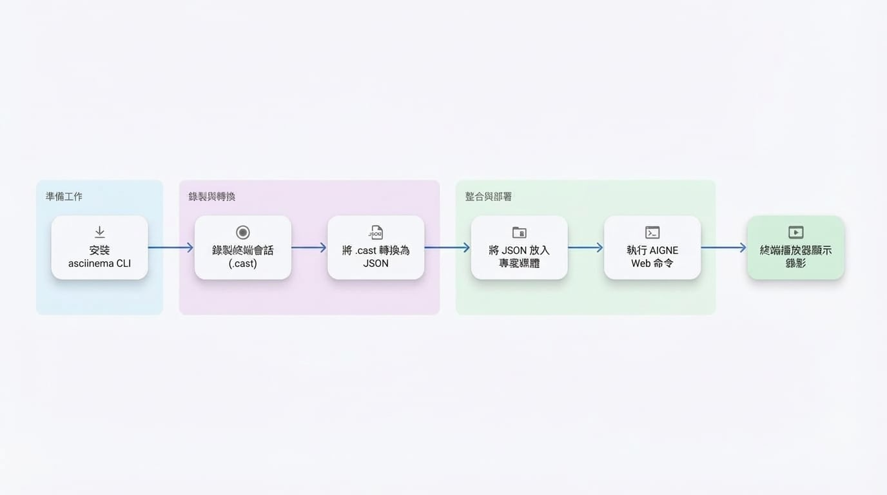

# 終端機播放器

終端機播放器 (Terminal Player) 是一個特殊元件，用於在您的網站上顯示互動式的預錄終端機操作過程。此元件是一個有效的工具，能以清晰且可重播的格式，展示命令列指令、軟體安裝過程，或引導使用者完成技術流程。

此元件使用以 `asciinema` 格式建立的錄製檔，確保能以輕量、基於文字的方式擷取終端機輸出。

## 流程概覽

使用終端機播放器的工作流程可分解為一系列清晰、易於管理的步驟。此流程始於開發者錄製終端機操作過程，並以終端使用者在網站上觀看互動式重播作結。

下圖說明了此流程：

<!-- DIAGRAM_IMAGE_START:flowchart:16:9:1765348253 -->

<!-- DIAGRAM_IMAGE_END -->

## 建立終端機錄製檔

若要使用終端機播放器，您必須先建立一個錄製檔。推薦的工具是 `asciinema`，這是一個用於錄製和分享終端機操作過程的開源命令列工具。

### 步驟 1：安裝 `asciinema` CLI

首先，在您的本機電腦上安裝 `asciinema` 工具。安裝方法因您的作業系統而異。

```bash 安裝 icon=lucide:download
# 在 macOS 上使用 Homebrew
brew install asciinema

# 在 Ubuntu/Debian 上使用 APT
sudo apt install asciinema

# 使用 pipx (跨平台)
pipx install asciinema
```

如需其他安裝選項，請參閱官方 [asciinema 文件](https://docs.asciinema.org/)。

### 步驟 2：錄製您的操作過程

安裝 `asciinema` 後，您可以透過執行 `rec` 指令開始錄製終端機操作過程。

```bash 錄製指令 icon=lucide:radio-tower
# 開始新的錄製，並將其儲存至 'my-demo.cast'
asciinema rec my-demo.cast
```

啟動指令後，在您的終端機中執行所有您希望擷取的動作。若要停止錄製，請按下 `Ctrl+D` 或輸入 `exit` 指令。一個名為 `my-demo.cast` 的檔案將儲存在您目前的目錄中。您可以透過執行 `asciinema play my-demo.cast` 在本機驗證播放。

**重要注意事項：**
*   **規劃您的步驟：** 錄製會擷取所有動作，包括暫停和錯誤。建議事先準備好腳本。
*   **終端機尺寸：** 播放器將複製錄製時所用終端機的欄寬和列高。請確保您的終端機視窗大小適當，以防止播放時內容換行或被截斷。

### 步驟 3：將 `.cast` 檔案轉換為 JSON

終端機播放器元件要求錄製資料為特定的 JSON 格式。我們提供了一個線上轉換器來簡化此轉換過程。

1.  **前往轉換器：** 在您的網頁瀏覽器中開啟 [ArcBlock Terminal Player Converter](https://arcblock.github.io/ux/?path=/story/data-display-terminal-player--recording-guide)。
2.  **上傳您的檔案：** 將您的 `.cast` 檔案拖曳到頁面上。
3.  **預覽並下載：** 該工具將產生您錄製內容的即時預覽。確認無誤後，下載轉換後的 `.json` 檔案。
4.  **加入專案：** 將下載的 JSON 檔案放入您網站的媒體或資產目錄中。

## 使用錄製檔

一旦 JSON 錄製檔被放置在您專案的媒體或資產目錄中，AI 即可使用它。無需在 YAML 檔案中手動設定此元件。

只需在您的內容來源檔案中描述需要終端機演示。當您執行 `aigne web generate` 或 `aigne web update` 時，AI 將自動找到相關的 `.json` 錄製檔，並使用終端機播放器元件將其顯示在您的網站上。

```bash AIGNE CLI 指令 icon=lucide:terminal
# 從頭開始產生網站
aigne web generate
 
# 使用您的變更更新網站
aigne web update
```

如需有關錄製的更多資訊，您可以查閱官方 [asciinema 網站](https://asciinema.org/)。

## 其他資源

- [ArcBlock Terminal Player Converter](https://arcblock.github.io/ux/?path=/story/data-display-terminal-player--recording-guide)
- [asciinema Documentation](https://docs.asciinema.org/)
