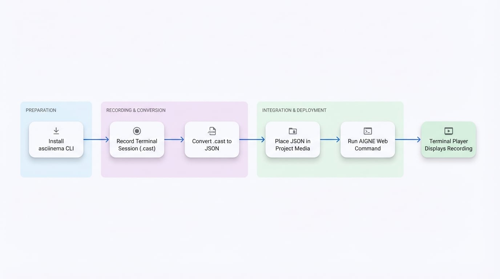

# 终端播放器

终端播放器是一个专用组件，用于在您的网站上显示可交互的、预先录制的终端会话。该组件是演示命令行指令、展示软件安装过程或以清晰、可重放的格式引导用户完成技术流程的有效工具。

该组件使用 `asciinema` 格式创建的录制文件，确保了对终端输出的轻量级、基于文本的捕获。

## 流程概述

使用终端播放器的工作流程可以分解为一系列清晰、可管理的步骤。该过程始于开发者录制终端会话，最终由最终用户在网站上查看交互式回放。

下图说明了此过程：

<!-- DIAGRAM_IMAGE_START:flowchart:16:9 -->

<!-- DIAGRAM_IMAGE_END -->

## 创建终端录制

要使用终端播放器，您必须首先创建一个录制文件。推荐使用的工具是 `asciinema`，这是一款用于录制和分享终端会话的开源命令行实用工具。

### 步骤 1：安装 `asciinema` CLI

首先，在您的本地计算机上安装 `asciinema` 工具。安装方法因您的操作系统而异。

```bash 安装 icon=lucide:download
# 在 macOS 上使用 Homebrew
brew install asciinema

# 在 Ubuntu/Debian 上使用 APT
sudo apt install asciinema

# 使用 pipx (跨平台)
pipx install asciinema
```

有关其他安装选项，请参阅官方 [asciinema 文档](https://docs.asciinema.org/)。

### 步骤 2：录制您的会话

安装 `asciinema` 后，您可以通过执行 `rec` 命令开始录制终端会话。

```bash 录制命令 icon=lucide:radio-tower
# 开始一个新的录制，将保存到 'my-demo.cast'
asciinema rec my-demo.cast
```

启动该命令后，在您的终端中执行所有您希望捕获的操作。要停止录制，请按 `Ctrl+D` 或键入 `exit` 命令。一个名为 `my-demo.cast` 的文件将保存在您的当前目录中。您可以通过运行 `asciinema play my-demo.cast` 在本地验证回放。

**重要注意事项：**
*   **规划您的步骤：** 录制会捕获所有操作，包括停顿和错误。建议事先准备好脚本。
*   **终端尺寸：** 播放器将复制用于录制的终端的列和行尺寸。请确保您的终端窗口大小适当，以防止在回放期间内容换行或被截断。

### 步骤 3：将 `.cast` 文件转换为 JSON

终端播放器组件要求录制数据为特定的 JSON 格式。有一个在线转换器可以简化此转换过程。

1.  **导航至转换器：** 在您的网络浏览器中打开 [ArcBlock 终端播放器转换器](https://arcblock.github.io/ux/?path=/story/data-display-terminal-player--recording-guide)。
2.  **上传您的文件：** 将您的 `.cast` 文件拖放到页面上。
3.  **预览和下载：** 该工具将生成您录制的实时预览。确认无误后，下载转换后的 `.json` 文件。
4.  **添加到项目：** 将下载的 JSON 文件放入您网站的媒体或资产目录中。
 
## 使用录制文件
 
一旦 JSON 录制文件被放置在您项目的媒体或资产目录中，它就可以被 AI 使用。无需在 YAML 文件中手动配置该组件。
 
只需在您的内容源文件中描述需要终端演示。当您运行 `aigne web generate` 或 `aigne web update` 时，AI 将自动找到相关的 `.json` 录制文件，并使用终端播放器组件将其显示在您的网站上。
 
```bash AIGNE CLI 命令 icon=lucide:terminal
# 从头开始生成网站
aigne web generate
 
# 使用您的更改更新网站
aigne web update
```
 
有关录制的更多信息，您可以查阅官方 [asciinema 网站](https://asciinema.org/)。

## 其他资源

- [ArcBlock 终端播放器转换器](https://arcblock.github.io/ux/?path=/story/data-display-terminal-player--recording-guide)
- [asciinema 文档](https://docs.asciinema.org/)
