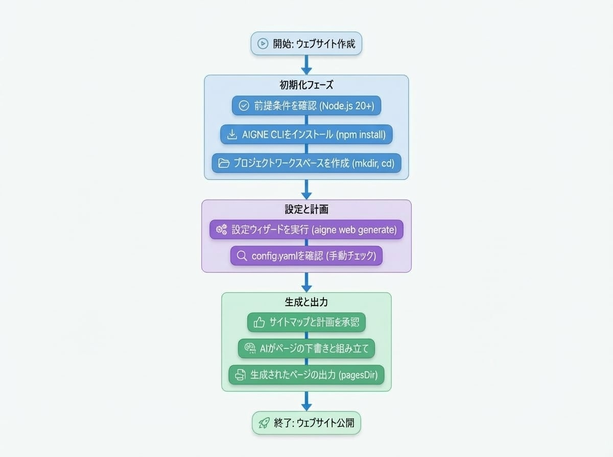

# はじめに

このガイドを参考に、サイトを最速で立ち上げましょう。AIGNE CLI のインストール、ソース資料の収集、`aigne web generate` の実行、計画の承認、生成されたページの確認まで、すべてを 1 か所で行えます。

## エンドツーエンドのフローを見る

<!-- DIAGRAM_IMAGE_START:flowchart:4:3:1765349001 -->

<!-- DIAGRAM_IMAGE_END -->

## 前提条件

- **Node.js 20 以降** (npm が含まれています)。`node -v` で確認してください。
- **AIGNE アカウント** (任意)。API キーを追加しなくても、AIGNE CLI に同梱されているホストされたモデルを使用できます。
- 製品やサービスを説明する**ソース資料**。より詳細なチェックリストについては、[資料の準備](./reference-prepare-materials.md)ガイドをお読みください。

## ステップ 1. AIGNE CLI のインストールと検証

AIGNE CLI をグローバルにインストールして、どのフォルダからでも `aigne` コマンドが利用できるようにします。

```bash AIGNE CLI のインストール icon=lucide:terminal
npm install -g @aigne/cli
```

インストールが成功したことを確認します。

```bash --help icon=lucide:terminal
aigne web --help
```

ベータチャネルが必要ですか？`npm install -g @aigne/cli@beta` でインストールし、`aigne web upgrade --beta` を実行して最新の Agent を取得してください。

## ステップ 2. プロジェクトワークスペースの作成

最初のサイト用にクリーンなディレクトリを設定し、そのディレクトリに移動します。

```bash ワークスペースの作成 icon=mdi:folder-open
mkdir my-first-websmith-site
cd my-first-websmith-site
```

このフォルダ内 (または近くの `sources` ディレクトリ) に、AI に読み込ませたいドキュメント、概要、メディアをコピーまたは作成します。明確に定義された資料は、出力品質を劇的に向上させるため、数分かけて[準備チェックリスト](./reference-prepare-materials.md)に従ってください。

## ステップ 3. `aigne web generate` を実行する

プロジェクトディレクトリから、ジェネレーターを起動します。

```bash ウェブサイトの生成 icon=material-symbols:rocket-launch-outline
aigne web generate
```

これは新しいワークスペースであるため、WebSmith は対話型のウィザードを起動し、以下の情報を収集します。

1.  **ウェブサイトの目的** - 例: SaaS マーケティングサイト、ドキュメントハブ、投資家向けアップデート。
2.  **ターゲットオーディエンス** - 開発者、顧客、投資家など。読者に合わせてトーンと証明を調整します。
3.  **ウェブサイトの規模** - 最小、標準、包括的から選択するか、AI に決定させます。
4.  **言語** - プライマリロケールと生成する翻訳を選択します。
5.  **ページディレクトリ** - 生成されたファイルが保存される場所 (デフォルトは `aigne/web-smith/pages`)。
6.  **ソースパス** - 製品知識を含むディレクトリまたはファイル。
7.  **カスタムルール** - トーン、用語、コンプライアンスに関するリマインダーなどの制約。

あなたの回答は `.aigne/doc-smith/config.yaml` に書き込まれ、次回の実行時に再利用できます。

## ステップ 4. 設定の確認

生成された設定ファイルを開き、特に `sourcesPath` の値が正しいかを確認します。以下は、簡略化された例です。

```yaml config.yaml icon=mdi:file-document-outline
projectName: My Awesome Project
projectDesc: This is a project that does amazing things.
pagePurpose:
  - saas
targetAudienceTypes:
  - developers
websiteScale: standard
locale: en
pagesDir: aigne/web-smith/pages
sourcesPath:
  - ./docs
  - ./briefs/product-overview.md
  - ./evidence
rules: >
  Use confident, concrete copy. Highlight 99.99% uptime and SOC 2 compliance.
```

> **重要:** `sourcesPath` は AI が参照できるすべてのものを制御します。生成されるコピーが正確であるように、概要、仕様書、価格表、証明を含む正確なディレクトリを指すようにしてください。

## ステップ 5. 計画の承認とページの検査

設定ファイルを読み取った後、WebSmith はサイトマップ (ページ、セクション、主要な論点) を提案します。これを承認すると、AI がコンテンツを作成し、Astro/React テンプレートを組み立てます。実行が完了すると、以下が表示されます。

- 選択した `pagesDir` 内に生成されたファイル。
- 各ページのログ。どのソースファイルが使用されたかを示します。
- 次のアクション (公開、翻訳、または反復) の提案。

生成されたページをローカルで開くか、[ウェブサイトの公開](./guides-publish-website.md)ガイドに直接進んで、それらを本番環境にプッシュします。

## 次のステップ

<x-cards data-columns="3">
  <x-card data-title="資料の準備" data-icon="lucide:folder-check" data-href="/reference/prepare-materials">
    反復可能なコンテンツキットを構築し、すべての生成が高品質な入力から始まるようにします。
  </x-card>
  <x-card data-title="ウェブサイトの作成" data-icon="lucide:wrench" data-href="/guides/create-website">
    `generate` ワークフローの高度なオプションについてさらに詳しく学びます。
  </x-card>
  <x-card data-title="ウェブサイトの公開" data-icon="lucide:rocket" data-href="/guides/publish-website">
    生成されたページを WebSmith Cloud または独自のインフラでライブサイトに変えます。
  </x-card>
</x-cards>