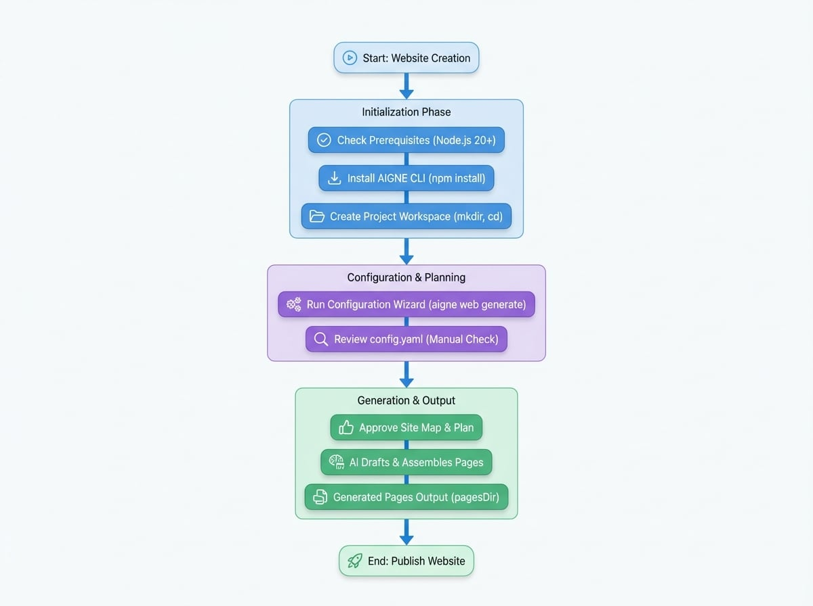

# Getting Started

Use this guide as the fastest path to a working site: install the AIGNE CLI, gather source materials, run `aigne web generate`, approve the plan, and review the generated pages—all in one place.

## See the end-to-end flow

<!-- DIAGRAM_IMAGE_START:flowchart:4:3:1765349001 -->

<!-- DIAGRAM_IMAGE_END -->

## Prerequisites

- **Node.js 20 or newer** (npm is included). Check with `node -v`.
- **AIGNE account** (optional). You can use the hosted models that ship with the AIGNE CLI without adding API keys.
- **Source material** that describes your product or service. For a deeper checklist, read the [Prepare Materials](./reference-prepare-materials.md) guide.

## Step 1. Install and verify the AIGNE CLI

Install the AIGNE CLI globally so the `aigne` command is available from any folder:

```bash Install AIGNE CLI icon=lucide:terminal
npm install -g @aigne/cli
```

Verify that installation succeeded:

```bash --help icon=lucide:terminal
aigne web --help
```

Need the beta channel? Install with `npm install -g @aigne/cli@beta` and run `aigne web upgrade --beta` to pick up the latest agents.

## Step 2. Create a project workspace

Set up a clean directory for your first site and switch into it:

```bash Create workspace icon=mdi:folder-open
mkdir my-first-websmith-site
cd my-first-websmith-site
```

Copy or create the documents, briefs, and media you want the AI to read inside this folder (or a nearby `sources` directory). Well-defined materials dramatically improve output quality, so spend a few minutes following the [preparation checklist](./reference-prepare-materials.md).

## Step 3. Run `aigne web generate`

From the project directory, start the generator:

```bash Generate website icon=material-symbols:rocket-launch-outline
aigne web generate
```

Because this is a new workspace, WebSmith launches an interactive wizard that captures:

1. **Website purpose** - e.g., SaaS marketing site, documentation hub, investor update.
2. **Target audiences** - developers, customers, investors, etc., so tone and proof match the reader.
3. **Website scale** - choose minimal, standard, comprehensive, or let the AI decide.
4. **Languages** - pick the primary locale and any translations to produce.
5. **Pages directory** - where generated files are stored (defaults to `aigne/web-smith/pages`).
6. **Source paths** - directories or files that contain your product knowledge.
7. **Custom rules** - constraints such as tone, terminology, or compliance reminders.

Your answers are written to `.aigne/doc-smith/config.yaml` so future runs can reuse them.

## Step 4. Review the configuration

Open the generated config and sanity-check the values, especially `sourcesPath`. Below is a trimmed example:

```yaml config.yaml icon=mdi:file-document-outline
projectName: My Awesome Project
projectDesc: This is a project that does amazing things.
pagePurpose:
  - saas
targetAudienceTypes:
  - developers
websiteScale: standard
locale: en
pagesDir: aigne/web-smith/pages
sourcesPath:
  - ./docs
  - ./briefs/product-overview.md
  - ./evidence
rules: >
  Use confident, concrete copy. Highlight 99.99% uptime and SOC 2 compliance.
```

> **Important:** `sourcesPath` controls everything the AI can reference. Point it to the exact directories that contain your briefs, specs, pricing sheets, and proof so the generated copy is accurate.

## Step 5. Approve the plan and inspect pages

After reading your config, WebSmith proposes a site map (pages, sections, and key talking points). Approve it to let the AI draft content and assemble the Astro/React templates. When the run finishes you will see:

- Generated files inside the `pagesDir` you selected.
- Logs for each page that show which source files were used.
- Suggestions for next actions (publish, translate, or iterate).

Open the generated pages locally or continue straight to the [Publish Website](./guides-publish-website.md) guide to push them live.

## What's next?

<x-cards data-columns="3">
  <x-card data-title="Prepare Materials" data-icon="lucide:folder-check" data-href="/reference/prepare-materials">
    Build a repeatable content kit so every generation starts with high-quality inputs.
  </x-card>
  <x-card data-title="Create Website" data-icon="lucide:wrench" data-href="/guides/create-website">
    Dive deeper into advanced options for the `generate` workflow.
  </x-card>
  <x-card data-title="Publish Website" data-icon="lucide:rocket" data-href="/guides/publish-website">
    Turn the generated pages into a live site on WebSmith Cloud or your own infra.
  </x-card>
</x-cards>