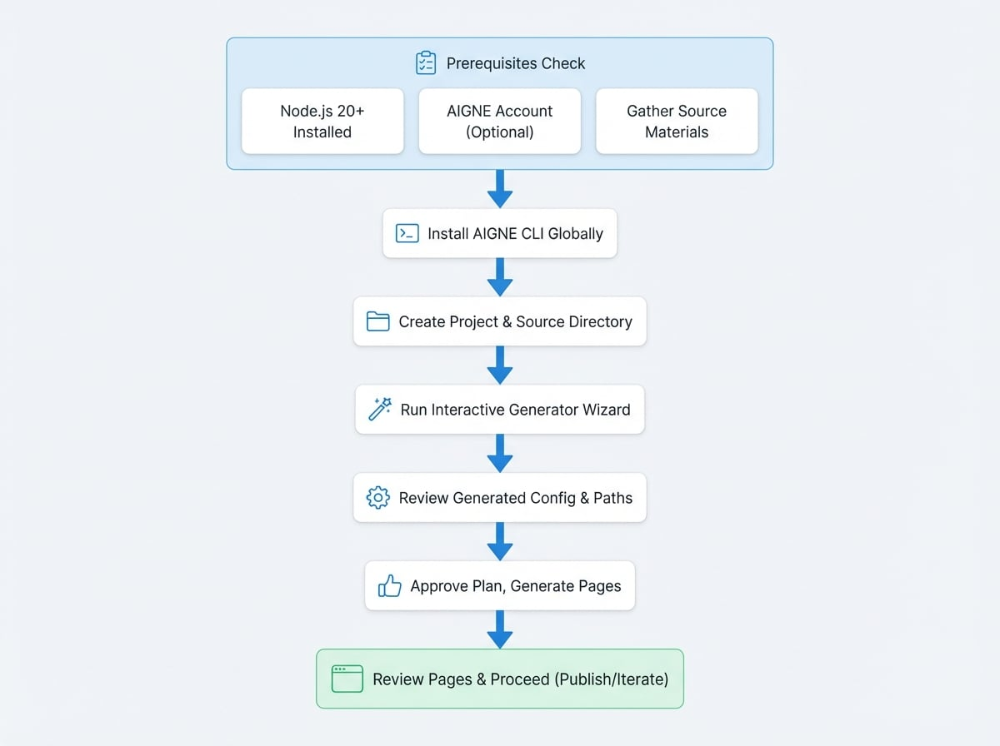

# 入门指南

本指南将为您提供搭建一个可运行网站的最快路径：安装 AIGNE CLI、收集源材料、运行 `aigne web generate`、批准计划并审查生成的页面——所有操作一站式完成。

## 查看端到端流程

<!-- DIAGRAM_IMAGE_START:guide:16:9 -->

<!-- DIAGRAM_IMAGE_END -->

## 前提条件

- **Node.js 20 或更新版本**（包含 npm）。请使用 `node -v` 命令检查。
- **AIGNE 账户**（可选）。您可以使用 AIGNE CLI 自带的托管模型，无需添加 API 密钥。
- **描述您的产品或服务的源材料**。如需更详细的清单，请阅读[准备材料](./reference-prepare-materials.md)指南。

## 步骤 1：安装并验证 AIGNE CLI

全局安装 AIGNE CLI，以便 `aigne` 命令在任何文件夹中都可用：

```bash 安装 AIGNE CLI icon=lucide:terminal
npm install -g @aigne/cli
```

验证安装是否成功：

```bash --help icon=lucide:terminal
aigne web --help
```

需要测试版（beta）频道？请使用 `npm install -g @aigne/cli@beta` 进行安装，并运行 `aigne web upgrade --beta` 以获取最新的 agents。

## 步骤 2：创建项目工作区

为您的第一个网站设置一个干净的目录，并切换到该目录：

```bash 创建工作区 icon=mdi:folder-open
mkdir my-first-websmith-site
cd my-first-websmith-site
```

将您希望 AI 读取的文档、简报和媒体文件复制或创建到此文件夹（或附近的 `sources` 目录）内。定义明确的材料能显著提高输出质量，因此请花几分钟时间遵循[准备清单](./reference-prepare-materials.md)。

## 步骤 3：运行 `aigne web generate`

在项目目录中，启动生成器：

```bash 生成网站 icon=material-symbols:rocket-launch-outline
aigne web generate
```

由于这是一个新的工作区，WebSmith 会启动一个交互式向导来收集以下信息：

1.  **网站用途** - 例如，SaaS 营销网站、文档中心、投资者更新。
2.  **目标受众** - 开发者、客户、投资者等，以便语气和论证与读者相匹配。
3.  **网站规模** - 选择最小、标准、全面，或让 AI 决定。
4.  **语言** - 选择主要语言区域以及任何需要生成的翻译版本。
5.  **页面目录** - 生成文件的存储位置（默认为 `aigne/web-smith/pages`）。
6.  **源路径** - 包含您产品知识的目录或文件。
7.  **自定义规则** - 约束条件，如语气、术语或合规性提醒。

您的回答将被写入 `.aigne/doc-smith/config.yaml` 文件，以便将来运行时可以重用。

## 步骤 4：审查配置

打开生成的配置文件，并检查其值的合理性，尤其是 `sourcesPath`。以下是一个精简的示例：

```yaml config.yaml icon=mdi:file-document-outline
projectName: My Awesome Project
projectDesc: This is a project that does amazing things.
pagePurpose:
  - saas
targetAudienceTypes:
  - developers
websiteScale: standard
locale: en
pagesDir: aigne/web-smith/pages
sourcesPath:
  - ./docs
  - ./briefs/product-overview.md
  - ./evidence
rules: >
  Use confident, concrete copy. Highlight 99.99% uptime and SOC 2 compliance.
```

> **重要提示：** `sourcesPath` 控制着 AI 可以引用的所有内容。请将其指向包含您的简报、规格、定价表和证明材料的确切目录，以确保生成的文案准确无误。

## 步骤 5：批准计划并检查页面

在读取您的配置后，WebSmith 会提出一个站点地图（页面、章节和关键要点）。批准它，让 AI 起草内容并组装 Astro/React 模板。运行结束后，您将看到：

- 生成的文件位于您选择的 `pagesDir` 目录内。
- 每个页面的日志，显示了使用了哪些源文件。
- 后续操作的建议（发布、翻译或迭代）。

您可以在本地打开生成的页面，或直接继续阅读[发布网站](./guides-publish-website.md)指南，将其上线。

## 接下来做什么？

<x-cards data-columns="3">
  <x-card data-title="准备材料" data-icon="lucide:folder-check" data-href="/reference/prepare-materials">
    构建一个可重复使用的内容套件，确保每次生成都始于高质量的输入。
  </x-card>
  <x-card data-title="创建网站" data-icon="lucide:wrench" data-href="/guides/create-website">
    深入了解 `generate` 工作流的更多高级选项。
  </x-card>
  <x-card data-title="发布网站" data-icon="lucide:rocket" data-href="/guides/publish-website">
    将生成的页面发布到 WebSmith Cloud 或您自己的基础设施上，使其成为一个实时网站。
  </x-card>
</x-cards>
