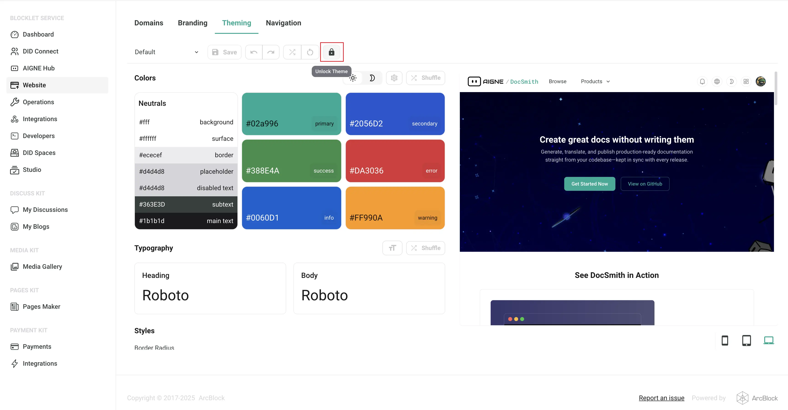

# Customize Theme

Consistent colors, typography, and spacing make your site feel professional. This guide walks through the exact commands to generate a new WebSmith theme with AI assistance and then apply it to your live site.

AIGNE WebSmith streamlines theme management with two sub-commands:

- **`theme generate`** – capture your design direction and save it as a YAML theme file.
- **`theme apply`** – upload any saved theme to your live site.

Follow the steps below to create and apply a theme end to end.

## Generating a New Theme

1. **Start the generator**

   ```bash Run command icon=lucide:terminal
   aigne web theme generate
   ```
   _Alias: `aigne web theme gen`_

2. **Describe the look and feel**  
   The terminal asks for a name, palette, typography, and mood. Provide concrete cues (“dark background, neon accents, rounded headings”) so the AI can shape the design.
3. **Review the preview list**  
   After generation, the theme appears in the local `themes` directory with metadata (primary color, fonts) as shown below. Edit the YAML if you want to fine‑tune tokens.


## Applying a Theme

After generating one or more themes, the `theme apply` command allows you to select a saved theme and apply it to your website. This command reads your local theme files, presents them as a list, and, upon your confirmation, uploads the selected theme to your site, making the changes live.

### Process

1.  **Run the Command**: Execute `aigne web theme apply` in your terminal.
2.  **Select a Theme**: The tool scans the `themes` directory and displays a list of all available themes you have generated. The list includes details like the theme name, primary color, and fonts to help you choose.
3.  **Review and Confirm**: The system will display the target website URL, the currently active theme, and the new theme you have selected. You will be asked for a final confirmation before any changes are made.
4.  **Apply to Website**: Once confirmed, the theme is uploaded and applied to your website. A success message will indicate that the process is complete.

### Usage

To apply an existing theme, use the command below.

```sh
aigne web theme apply
```

You can also specify the website URL directly as a parameter. If omitted, the `appUrl` from your `config.yaml` file will be used.

```sh
aigne web theme apply --appUrl https://your-website.com
```

### Parameters

The `apply` command accepts the following parameters:

<x-field-group>
  <x-field data-name="appUrl" data-type="string" data-required="false">
    <x-field-desc markdown>The full URL of your website. If you do not provide this, the command will use the `appUrl` defined in your `config.yaml` configuration file.</x-field-desc>
  </x-field>
  <x-field data-name="config" data-type="string" data-required="false">
    <x-field-desc markdown>The location of your configuration file. Defaults to the standard `config.yaml` path.</x-field-desc>
  </x-field>
</x-field-group>

### Handling a Locked Theme

To protect a website's live theme from accidental changes, Blocklet applications include a "theme lock" feature. If a theme is locked, any attempt to apply a new one from the terminal will be blocked.

When you try to apply a theme to a locked site, you will encounter a `403 Forbidden` error:

```
Failed to apply theme: Failed to upload theme data: 403 Forbidden
{"code":"internal_server_error","error":"Theme is locked and cannot be modified"}
```

To resolve this, you must unlock the theme through the website's administrative interface:

1.  **Log in** to your website's administrative dashboard.
2.  Navigate to **WebSite > Theming** in the admin menu.
3.  Click the **unlock button** to remove the theme lock.
4.  Run `aigne web theme apply` again.



---

By following these steps, you can effectively manage your website's visual identity. For the next step after updating your theme, you may want to review how to [publish your website](./guides-publish-website.md).
