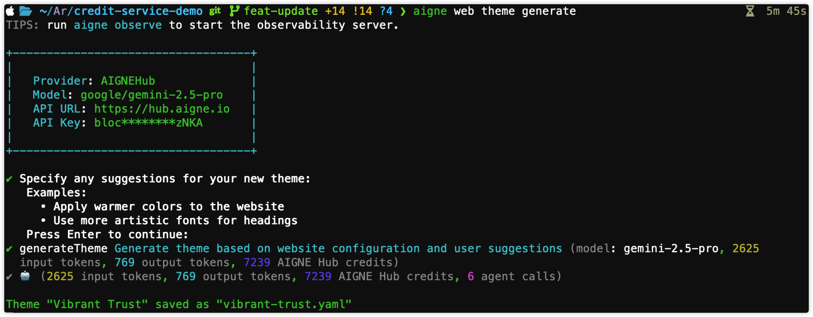

# 自訂佈景主題

一致的顏色、排版和間距能讓您的網站看起來更專業。本指南將引導您完成使用 AI 輔助產生新的 WebSmith 佈景主題，並將其套用至您線上網站的確切指令。

AIGNE WebSmith 透過兩個子指令簡化了佈景主題管理：

- **`theme generate`** – 捕捉您的設計方向並將其儲存為 YAML 佈景主題檔案。
- **`theme apply`** – 將任何已儲存的佈景主題上傳至您的線上網站。

請按照以下步驟從頭到尾建立並套用一個佈景主題。

## 產生新佈景主題

1. **啟動產生器**

   ```bash 執行指令 icon=lucide:terminal
   aigne web theme generate
   ```
   _別名：`aigne web theme gen`_

2. **描述外觀與風格**
   終端機會詢問名稱、調色盤、排版和氛圍。請提供具體的提示（例如「深色背景、霓虹色點綴、圓角標題」），以便 AI 塑造設計。
3. **檢視預覽清單**
   產生後，佈景主題會出現在本地的 `themes` 目錄中，並附帶元資料（主色、字體），如下圖所示。如果您想微調 token，可以編輯該 YAML 檔案。



## 套用佈景主題

在產生一個或多個佈景主題後，`theme apply` 指令可讓您選擇一個已儲存的佈景主題並將其套用至您的網站。此指令會讀取您本地的佈景主題檔案，將它們以列表形式呈現，並在您確認後，將所選的佈景主題上傳至您的網站，使變更生效。

### 流程

1.  **執行指令**：在您的終端機中執行 `aigne web theme apply`。
2.  **選擇佈景主題**：該工具會掃描 `themes` 目錄並顯示您已產生的所有可用佈景主題清單。清單中包含佈景主題名稱、主色和字體等詳細資訊，以幫助您選擇。
3.  **檢視並確認**：系統將顯示目標網站 URL、目前生效的佈景主題以及您選擇的新佈景主題。在進行任何變更之前，系統會要求您做最終確認。
4.  **套用至網站**：一旦確認，佈景主題將被上傳並套用至您的網站。一則成功訊息將表示此過程已完成。

### 使用方法

若要套用現有的佈景主題，請使用以下指令。

```sh
aigne web theme apply
```

您也可以直接將網站 URL 指定為參數。如果省略，將會使用您 `config.yaml` 檔案中的 `appUrl`。

```sh
aigne web theme apply --appUrl https://your-website.com
```

### 參數

`apply` 指令接受以下參數：

<x-field-group>
  <x-field data-name="appUrl" data-type="string" data-required="false">
    <x-field-desc markdown>您網站的完整 URL。如果您未提供此項，該指令將使用您 `config.yaml` 設定檔中定義的 `appUrl`。</x-field-desc>
  </x-field>
  <x-field data-name="config" data-type="string" data-required="false">
    <x-field-desc markdown>您的設定檔位置。預設為標準的 `config.yaml` 路徑。</x-field-desc>
  </x-field>
</x-field-group>

### 處理已鎖定的佈景主題

為了保護網站線上佈景主題免於意外變更，Blocklet 應用程式包含「佈景主題鎖定」功能。如果佈景主題被鎖定，任何從終端機套用新佈景主題的嘗試都將被阻止。

當您嘗試將佈景主題套用至已鎖定的網站時，您將會遇到 `403 Forbidden` 錯誤：

```
Failed to apply theme: Failed to upload theme data: 403 Forbidden
{"code":"internal_server_error","error":"Theme is locked and cannot be modified"}
```

若要解決此問題，您必須透過網站的管理介面解鎖佈景主題：

1.  **登入**您網站的管理儀表板。
2.  在管理選單中導覽至 **WebSite > Theming**。
3.  點擊**解鎖按鈕**以移除佈景主題鎖定。
4.  再次執行 `aigne web theme apply`。


---

透過遵循這些步驟，您可以有效地管理您網站的視覺識別。在更新您的佈景主題後的下一步，您可能需要檢視如何[發佈您的網站](./guides-publish-website.md)。