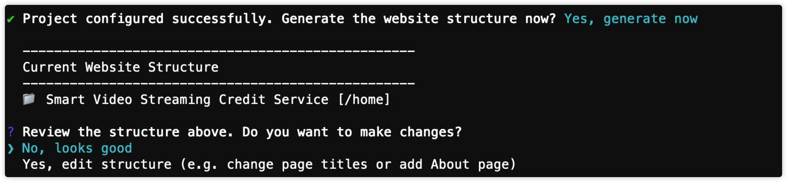
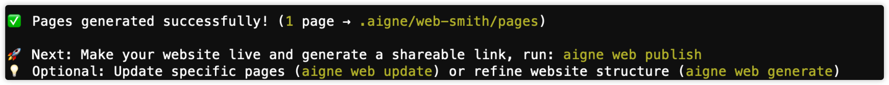

# ウェブサイトの生成

このガイドでは、単一のコマンドでソースマテリアルを公開可能なサイトに変換する方法を説明します。利用可能な `aigne web generate` フラグを確認し、AI が生成したサイトマップを承認し、完成したページがディスク上のどこに保存されるかを理解します。

すべてのフラグとエイリアスのクイックリファレンスが必要な場合は、`aigne web -h` を実行してください。以下に表示されるサンプル出力が表示されるはずです。


## 生成プロセス

`aigne web generate` コマンドは、ウェブサイト作成プロセス全体を開始します。設定を読み込み、ソースマテリアルを分析し、ウェブサイトの構造を計画し、各ページのコンテンツを生成し、最終的なファイルを組み立てます。

### 使用方法

生成プロセスを実行するには、ターミナルで次のコマンドを実行します。

```bash ウェブサイトを生成 icon=lucide:terminal
aigne web generate
```

`gen` や `g` といったエイリアスも使用できます。

```bash ウェブサイトを生成 icon=lucide:terminal
aigne web gen
```

### 生成プロセス

`generate` コマンドを実行すると、WebSmith は以下の順序で操作を実行します。

1.  **設定の読み込み**: まず、`config.yaml` ファイルを探して読み込み、高レベルの要件を理解します。このファイルが存在しない場合、自動的にガイド付きセットアップが開始され、ファイルが作成されます。
2.  **ソースの分析**: AI は、設定の `sourcesPath` で指定されたドキュメント、マークダウンファイル、その他のマテリアルをスキャンして、主題を理解します。
3.  **ウェブサイト構造の計画**: 目的、対象読者、ソースコンテンツに基づいて、AI はウェブサイトの論理的なサイトマップを提案し、すべてのページとその階層を概説します。コンテンツ生成が開始される前に、この構造を確認し、承認するよう求められます。



4.  **ページコンテンツの生成**: 承認された構造の各ページについて、AI はタイトル、説明、ヒーローバナー、機能リスト、FAQ などのプロフェッショナルなコンポーネントで構成されるセクションを含む詳細なコンテンツを生成します。
5.  **ウェブサイトファイルの保存**: 各ページの最終的な構造化されたコンテンツは、設定の `pagesDir` で指定されたディレクトリに YAML ファイルとして保存されます。これらのファイルは公開準備が整いました。



### パラメータ

`generate` コマンドは、その動作をカスタマイズするためのいくつかのオプションパラメータを受け入れます。

<x-field-group>
  <x-field data-name="glossary" data-type="string" data-required="false">
    <x-field-desc markdown>用語集ファイルへのパス（例：`@glossary.md`）を指定します。これにより、プロジェクト固有の用語が生成されたコンテンツ全体で一貫して使用されることが保証されます。</x-field-desc>
  </x-field>
  <x-field data-name="forceRegenerate" data-type="boolean" data-required="false">
    <x-field-desc markdown>`true` に設定すると、コマンドはすべてのページを最初から再生成し、以前に生成されたファイルを上書きします。これは、`config.yaml` ファイルやソースドキュメントに大幅な変更を加えた後に便利です。</x-field-desc>
  </x-field>
</x-field-group>

**パラメータ付きの例：**

```bash # ウェブサイトを再生成 icon=lucide:terminal
# 用語集ファイルを使用してウェブサイト全体を再生成する
aigne web generate --forceRegenerate --glossary "@glossary.md"
```

## 設定ファイル (`config.yaml`)

`config.yaml` ファイルは、ウェブサイトの設計図です。AI が特定のニーズを満たすサイトを構築するために必要なコンテキストと制約を提供します。このファイルは、プロジェクト、サイトの目的と対象読者、言語設定、およびファイルの場所を定義します。

以下は、`config.yaml` ファイル内の主要なプロパティの詳細な内訳です。

### 設定オプション

<x-field-group>
  <x-field data-name="projectName" data-type="string" data-required="true">
    <x-field-desc markdown>プロジェクトまたはウェブサイトの名前。メタデータや公開に使用されます。</x-field-desc>
  </x-field>
  <x-field data-name="projectDesc" data-type="string" data-required="false">
    <x-field-desc markdown>プロジェクトの簡単な説明。</x-field-desc>
  </x-field>
  <x-field data-name="projectLogo" data-type="string" data-required="false">
    <x-field-desc markdown>プロジェクトのロゴへの URL またはローカルパス。</x-field-desc>
  </x-field>
  <x-field data-name="pagePurpose" data-type="array" data-required="true">
    <x-field-desc markdown>ウェブサイトの主要な目標を定義する文字列の配列。例：`landingPage`, `ecommerce`, `portfolio`, `corporate`, `blog`, `saas`, `nonprofit`, `education`, `mixedPurpose`。</x-field-desc>
  </x-field>
  <x-field data-name="targetAudienceTypes" data-type="array" data-required="true">
    <x-field-desc markdown>主要な対象読者を特定する文字列の配列。例：`customers`, `businessOwners`, `marketers`, `designers`, `developers`, `investors`, `jobSeekers`, `students`, `generalPublic`。</x-field-desc>
  </x-field>
  <x-field data-name="websiteScale" data-type="string" data-required="true">
    <x-field-desc markdown>ウェブサイトの希望するサイズと複雑さを定義します。オプションには `singlePage`, `minimal`, `standard`, `comprehensive`, `aiDecide` が含まれます。</x-field-desc>
  </x-field>
  <x-field data-name="rules" data-type="string" data-required="false">
    <x-field-desc markdown>AIが生成中に従うべきカスタムルールや特定の指示のためのフィールド。例えば、トーン、除外するコンテンツ、または強調すべき特定のポイントなど。</x-field-desc>
  </x-field>
  <x-field data-name="locale" data-type="string" data-default="en" data-required="true">
    <x-field-desc markdown>ウェブサイトコンテンツの主要言語。言語コードで指定します（例：`en`, `zh`, `es`）。</x-field-desc>
  </x-field>
  <x-field data-name="translateLanguages" data-type="array" data-required="false">
    <x-field-desc markdown>ウェブサイトを翻訳する言語コードのリスト。例：`['zh', 'fr']`。</x-field-desc>
  </x-field>
  <x-field data-name="pagesDir" data-type="string" data-required="true">
    <x-field-desc markdown>生成されたウェブサイトのページファイルが保存されるローカルディレクトリのパス。</x-field-desc>
  </x-field>
  <x-field data-name="sourcesPath" data-type="array" data-required="true">
    <x-field-desc markdown>ソースコンテンツを指すファイルパスまたはglobパターンの配列。AIはこれらのファイルを分析してウェブサイトを生成します。</x-field-desc>
  </x-field>
</x-field-group>

### `config.yaml` の例

以下は、各セクションを説明するコメント付きの完全な `config.yaml` ファイルの例です。

```yaml config.yaml
# ページ公開のためのプロジェクト情報
projectName: AIGNE WebSmith
projectDesc: AI駆動のウェブサイト生成ツール
projectLogo: https://www.aigne.io/image-bin/uploads/bc5afab4e6d282cc7f4aa444e9b9f7f4.svg
projectId: aigne-websmith-docs
projectSlug: aigne-websmith

# =============================================================================
# ウェブサイト設定
# =============================================================================

# 目的：読者に達成してほしい主な成果は何か？
# 利用可能なオプション（必要に応じてコメントを解除し、変更してください）：
#   landingPage     - ランディングページ / ホームページ：訪問者をユーザーや顧客に変える
#   ecommerce       - Eコマース / オンラインストア：製品やサービスをオンラインで販売する
#   portfolio       - ポートフォリオ / ショーケース：創造的な作品、プロジェクト、実績を展示する
#   corporate       - コーポレート / ビジネス：企業情報を含むプロフェッショナルなビジネスウェブサイト
#   blog            - ブログ / コンテンツサイト：記事、ニュース、定期的なコンテンツ更新を共有する
#   saas            - SaaS / ソフトウェア製品：ソフトウェアサービスへのユーザーのプロモーションとオンボーディングを行う
#   nonprofit       - 非営利 / コミュニティ：理念を推進し、寄付を受け付け、ボランティアを募る
#   education       - 教育 / 学習：コース、チュートリアル、または教育コンテンツを提供する
#   mixedPurpose    - 多目的ウェブサイト：複数のニーズをカバーする包括的なウェブサイト
pagePurpose:
  - saas

# 対象読者：誰がこれを最も頻繁に読むか？
# 利用可能なオプション（必要に応じてコメントを解除し、変更してください）：
#   customers        - 顧客 / エンドユーザー：製品やサービスを購入または使用する人々
#   businessOwners   - ビジネスオーナー / 起業家：ソリューションを探しているビジネスを運営する人々
#   marketers        - マーケティングチーム：製品を宣伝したり、キャンペーンを管理したりする人々
#   designers        - デザイナー / クリエイティブプロフェッショナル：ビジュアルデザインとユーザーエクスペリエンスに焦点を当てる人々
#   developers       - 開発者 / 技術ユーザー：技術的なソリューションを構築または統合する人々
#   investors        - 投資家 / ステークホルダー：ビジネスの可能性と成長を評価する人々
#   jobSeekers       - 求職者 / 潜在的な従業員：キャリアの機会を探している人々
#   students         - 学生 / 学習者：教育コンテンツやリソースを求める人々
#   generalPublic    - 一般 / 混合読者：さまざまな興味や背景を持つ広範な読者
targetAudienceTypes:
  - developers

# ウェブサイトの規模：ウェブサイトには何ページ必要か？
# 利用可能なオプション（必要に応じてコメントを解除し、変更してください）：
#   singlePage      - シングルページ（1ページのみ）：すべてのコンテンツを1ページに集約
#   minimal         - 最小限（2〜6ページ）：コアページのみ - 迅速に立ち上げ可能
#   standard        - 標準（7〜12ページ）：主要セクションを備えた完全なウェブサイト [推奨]
#   comprehensive   - 包括的（12ページ以上）：詳細なセクションを備えたフル機能のウェブサイト
#   aiDecide        - AIに決定させる：プロジェクトの複雑さを分析し、適切な規模を提案
websiteScale: standard

# カスタムルール：特定のページ生成ルールと要件を定義する
rules: 'フォーマルで技術的なトーンを維持する。マーケティング用語は避ける。実践的でステップバイステップの指示に焦点を当てる。'

# 用語集：プロジェクト固有の用語と定義を定義する
# glossary: "@glossary.md"  # 用語集の定義を含むマークダウンファイルへのパス

locale: en
# translateLanguages:  # ページを翻訳する言語のリスト
#   - zh  # 例：中国語翻訳
#   - en  # 例：英語翻訳

pagesDir: ./aigne-web-smith/pages  # 生成されたページを保存するディレクトリ
sourcesPath:  # 分析するソースコードのパス
  - ./docs/**/*.md
  - ./README.md
defaultDatasources:  # すべてのページに含まれるデフォルトのデータソース
  - ./media.md
# minImageWidth: この値（ピクセル単位）より幅の広い画像のみがページ生成に使用されます
media:
  minImageWidth: 800
```

## まとめ

`generate` コマンドと明確に定義された `config.yaml` ファイルを組み合わせることで、正確な仕様に合わせた完全なウェブサイトを効率的に作成できます。このプロセスは、サイト構造とコンテンツ作成の重労働を自動化し、高品質なソースマテリアルの提供に集中できるようにします。

ウェブサイトを生成した後の次のステップは、それをオンラインで利用できるようにすることです。

参考文献：
*   [ウェブサイトの公開](./guides-publish-website.md)