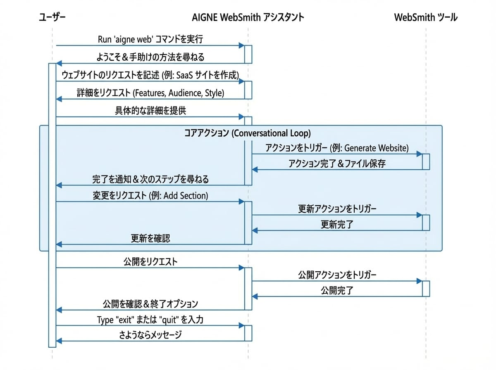

# インタラクティブモード（ベータ）

> **Note:** インタラクティブモードは現在ベータ版です。完全に機能しますが、予期せぬ動作が発生する可能性があります。この体験を改善し続けるため、皆様からのフィードバックをお待ちしております。

このガイドを使用して `aigne web chat` を起動し、自然言語で WebSmith に話しかけ、アシスタントにあなたに代わって生成/更新/公開アクションを実行させます。

`chat` コマンドは、ウェブサイトを構築・管理するための対話型の会話インターフェースを提供します。`generate` や `update` のような個別のコマンドを実行する代わりに、あなたのニーズを平易な言葉で説明するだけで、AI アシスタントがプロセスを案内してくれます。これは、よりガイド付きの体験を好むユーザーにとって理想的な出発点です。

## 仕組み

インタラクティブモードは、あなたのリクエストを理解し、他の WebSmith ツールを使用してタスクを実行できる専用の AI Agent によって動作します。会話の記憶を保持するため、連続した変更を加えたり、以前のアクションに基づいて構築したりすることが可能です。

一般的なワークフローは、以下の図に示すように、単純な会話ループに従います。

<!-- DIAGRAM_IMAGE_START:sequence:4:3:1765348253 -->

<!-- DIAGRAM_IMAGE_END -->

## インタラクティブセッションの開始

開始するには、ターミナルから `chat` コマンドを実行します。

```bash Command icon=lucide:terminal
aigne web
```

これによりアシスタントが起動し、挨拶をしてあなたの指示を待ちます。

## できること

チャットアシスタントは、AIGNE WebSmith CLI で利用可能なほとんどのコアタスクを実行できます。単純に以下のように依頼するだけです。

*   **新しいウェブサイトの生成**: ウェブサイトの要件、ターゲットオーディエンス、希望のスタイルを説明します。
*   **既存コンテンツの更新**: 変更したいページやセクションを指定し、新しい詳細を提供します。
*   **ページの翻訳**: 特定のページを別の言語に翻訳するようリクエストします。
*   **サイトの公開**: Pages Kit にウェブサイトを公開する準備ができたことをアシスタントに伝えます。
*   **ファイルの管理**: 現在のファイル構造や特定のページの内容を表示するよう依頼します。

## 会話例

以下は、インタラクティブモードを使用して簡単なウェブサイトを作成、修正、公開する方法の例です。

```bash Command Line icon=lucide:terminal
aigne web

> AIGNE WebSmith インタラクティブアシスタントへようこそ！
> 本日はどのようなウェブサイト構築のお手伝いをいたしましょうか？

You:
チームのプロジェクト管理を支援する新しいSaaS製品のウェブサイトを作成する必要があります。

> かしこまりました。もう少し詳細を教えていただけますか？
> - 製品の主な機能は何ですか？
> - ターゲットオーディエンスは誰ですか？
> - ウェブサイトはどのようなスタイル（例：ビジネス、モダン、遊び心のある）にすべきですか？

You:
主な機能はタスク追跡、チームコラボレーション、レポーティングです。ターゲットオーディエンスは中小企業の経営者です。モダンなビジネススタイルでお願いします。

> ありがとうございます。ウェブサイトの構造を計画するのに十分な情報を得ました。
> これから以下のページを生成します：
> - ホーム
> - 機能
> - 価格
> - 会社概要
> - お問い合わせ
> ...
> [生成プロセス開始]
> ...
> ウェブサイトの生成が完了しました。ファイルは「output」ディレクトリに保存されました。
> 次に何をしますか？

You:
ホームページに顧客の推薦文のセクションを追加してください。

> 承知いたしました。ホームページに顧客の推薦文セクションを追加します。
> [更新プロセス開始]
> ...
> ホームページが更新されました。他に何かありますか？

You:
いいえ、今のところは以上です。ウェブサイトを公開してください。

> 設定された Pages Kit プロジェクトにウェブサイトを公開します。
> [公開プロセス開始]
> ...
> あなたのウェブサイトは正常に公開されました。
> 「exit」と入力するとチャットを終了できます。

You:
exit

> さようなら！
```

## インタラクティブモードの終了

セッションをいつでも終了するには、`exit` または `quit` と入力して Enter キーを押します。

---

インタラクティブモードは、特定のコマンドやパラメータを覚える必要なく、ウェブサイトのライフサイクル全体を管理する強力な方法です。より直接的な制御が必要な場合は、いつでも次のセクションで詳述されている標準コマンドを使用できます。

### 関連資料

*   [ウェブサイトの作成](./guides-create-website.md)
*   [ウェブサイトの更新](./guides-update-website.md)
*   [ウェブサイトの公開](./guides-publish-website.md)
