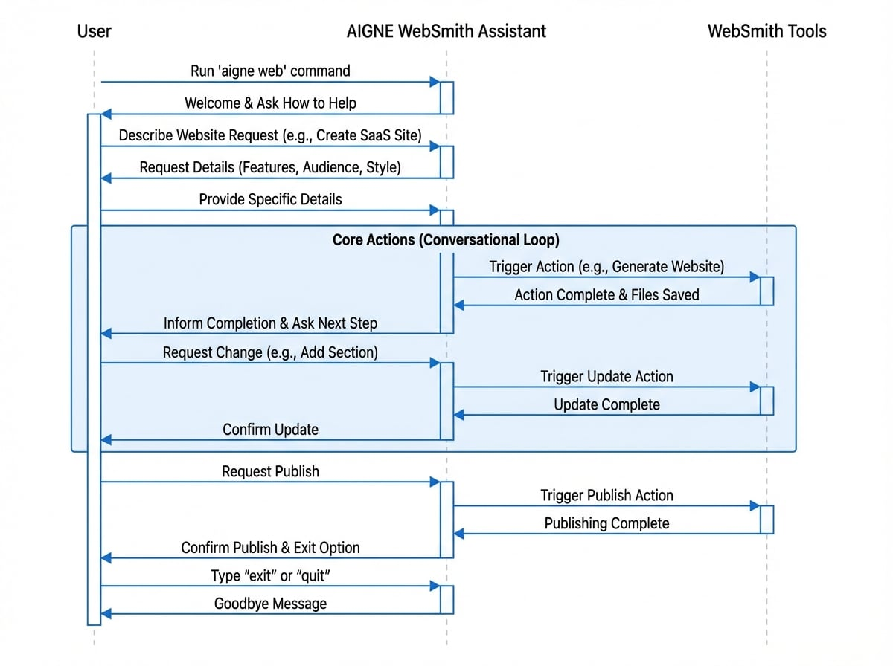

# 交互模式（测试版）

> **注意：** 交互模式目前处于测试阶段。虽然功能齐全，但您可能会遇到意外行为。在我们不断改进此体验的过程中，我们非常感谢您的反馈。

本指南将引导您启动 `aigne web chat`，用自然语言与 WebSmith 对话，并让助手代您触发生成/更新/发布操作。

`chat` 命令提供了一个交互式的对话界面，用于构建和管理您的网站。您无需运行像 `generate` 或 `update` 这样的单个命令，而是可以用简单的语言描述您的需求，AI 助手将引导您完成整个过程。对于偏好更有指导性体验的用户来说，这是一个理想的起点。

## 工作原理

交互模式由一个专用的 AI agent 提供支持，该 agent 能理解您的请求，并能使用其他 WebSmith 工具来执行任务。它会记住您的对话内容，让您可以进行连续的更改并在之前的操作基础上继续构建。

总体工作流程遵循一个简单的对话循环，如下图所示：

<!-- DIAGRAM_IMAGE_START:guide:4:3 -->

<!-- DIAGRAM_IMAGE_END -->

## 启动交互式会话

首先，在您的终端中运行 `chat` 命令：

```bash 命令 icon=lucide:terminal
aigne web
```

这将启动助手，它会向您问好并等待您的指令。

## 您可以做什么

聊天助手可以执行 AIGNE WebSmith CLI 中可用的大多数核心任务。您可以直接要求它：

*   **生成一个新网站**：描述您的网站需求、目标受众和期望的风格。
*   **更新现有内容**：指明您想更改哪个页面或部分，并提供新的详细信息。
*   **翻译页面**：请求将特定页面翻译成另一种语言。
*   **发布您的网站**：告诉助手您已准备好将网站发布到 Pages Kit。
*   **管理文件**：要求查看当前的文件结构或特定页面的内容。

## 对话示例

以下是一个示例，展示了如何使用交互模式来创建、修改和发布一个简单的网站。

```bash 命令行 icon=lucide:terminal
aigne web

> Welcome to the AIGNE WebSmith interactive assistant!
> How can I help you build your website today?

You:
I need to create a website for a new SaaS product that helps teams manage their projects.

> Of course. Could you please provide a few more details?
> - What are the core features of the product?
> - Who is the target audience?
> - What style should the website have (e.g., business, modern, playful)?

You:
The main features are task tracking, team collaboration, and reporting. The target audience is small to medium-sized business owners. Let's go with a modern business style.

> Thank you. I have enough information to plan the website structure.
> I will now generate the following pages:
> - Home
> - Features
> - Pricing
> - About Us
> - Contact
> ...
> [Generation process starts]
> ...
> Website generation is complete. The files have been saved to the 'output' directory.
> What would you like to do next?

You:
On the homepage, add a section for customer testimonials.

> Understood. I will add a customer testimonials section to the homepage.
> [Update process starts]
> ...
> The homepage has been updated. Is there anything else?

You:
No, that's all for now. Please publish the website.

> I will now publish the website to your configured Pages Kit project.
> [Publishing process starts]
> ...
> Your website has been successfully published.
> You can now exit the chat by typing 'exit'.

You:
exit

> Goodbye!
```

## 退出交互模式

要随时结束会话，请输入 `exit` 或 `quit` 并按 Enter 键。

---

交互模式是一种强大的方式，可以管理您的整个网站生命周期，而无需记住特定的命令和参数。如果需要更直接的控制，您始终可以使用后续章节中详述的标准命令。

### 进一步阅读

*   [创建网站](./guides-create-website.md)
*   [更新网站](./guides-update-website.md)
*   [发布网站](./guides-publish-website.md)
