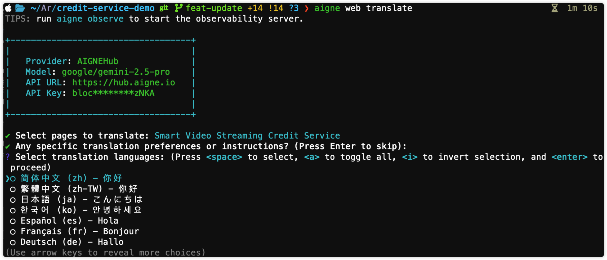

# Localize Website

Use this guide to run `aigne web translate`, select the pages and languages you want, and save localized versions that are ready to publish alongside your primary site.

AIGNE WebSmith provides a powerful and straightforward way to automatically translate your website content into multiple languages, enabling you to reach a global audience with minimal effort. The `translate` command uses AI to generate high-quality translations for your existing pages.

This document will guide you through the process of translating your content, from basic interactive usage to more advanced options using command-line parameters.

## How Translation Works

The translation process is designed to be simple and efficient. When you run the `translate` command, WebSmith performs the following steps:

1.  **Identifies Source Content**: It loads your existing website structure and content, determining the primary language from your configuration.
2.  **Selects Pages**: You can specify which pages to translate. If you don't, it will present an interactive list of all available pages for you to choose from.
3.  **Chooses Target Languages**: You can provide a list of target languages. If you don't, it will display a list of supported languages for you to select.
4.  **Generates Translations**: The AI processes the content of each selected page and generates a translated version for every chosen language. It can use an optional glossary to ensure consistent terminology.
5.  **Saves Translated Files**: The newly translated pages are saved into language-specific directories, ready for you to review and publish.

## Basic Usage

For the most straightforward approach, you can run the command without any parameters. WebSmith will guide you through the process with interactive prompts.

Run the following command in your terminal:

```bash Localize Website icon=lucide:terminal
aigne web translate
```



You will be prompted to:
1.  Select the pages you wish to translate (use the spacebar to select and enter to confirm).
2.  Select the target languages from a list of supported options.

Once you've made your selections, the AI will begin the translation process.

## Command Parameters

For more control and for use in automated scripts, you can use the following command-line parameters.

<x-field-group>
  <x-field data-name="--pages" data-type="array" data-required="false">
    <x-field-desc markdown>An array of page paths to translate. If omitted, you will be prompted to select pages interactively. For example: `--pages /about /contact`</x-field-desc>
  </x-field>
  <x-field data-name="--langs" data-type="array" data-required="false">
    <x-field-desc markdown>An array of language codes to translate to. If omitted, you will be prompted to select languages interactively. See the table below for a full list of supported languages.</x-field-desc>
  </x-field>
  <x-field data-name="--glossary" data-type="string" data-required="false">
    <x-field-desc markdown>A glossary of specific terms to ensure consistent terminology during translation. You can provide a string of key-value pairs or reference a file path using the `@` prefix (e.g., `@./glossary.txt`).</x-field-desc>
  </x-field>
  <x-field data-name="--feedback" data-type="string" data-required="false">
    <x-field-desc markdown>Provide feedback to the AI to refine and improve existing translations. This is useful for making corrections or adjusting the tone.</x-field-desc>
  </x-field>
</x-field-group>

## Examples

### Translate Specific Pages into Multiple Languages

This command translates the `/about-us` and `/services/main` pages into Japanese and French without interactive prompts.

```bash Translate Specific Pages icon=lucide:terminal
aigne web translate --pages /about-us /services/main --langs ja fr
```

### Using a Glossary for Consistent Terminology

To ensure that your brand name "WebSmith" and the term "SaaS" are translated consistently into Spanish, you can use the `--glossary` parameter.

```bash Translate With Glossary icon=lucide:terminal
aigne web translate --langs es --glossary "WebSmith:WebSmith AI,SaaS:Software como Servicio"
```

For a larger glossary, it is more practical to use a file. Create a file named `glossary.txt` with your terms, and then reference it.

```bash Translate With Glossary File icon=lucide:terminal
aigne web translate --langs de --glossary @./glossary.txt
```

## Supported Languages

The following table lists all languages currently available for translation.

| Language | Code |
| :--- | :--- |
| English | `en` |
| Chinese (Simplified) | `zh` |
| Chinese (Traditional) | `zh-TW` |
| Japanese | `ja` |
| French | `fr` |
| German | `de` |
| Spanish | `es` |
| Italian | `it` |
| Russian | `ru` |
| Korean | `ko` |
| Portuguese | `pt` |
| Arabic | `ar` |

---

After translating your content, the next logical step is to make it available to your users. Learn how to deploy your multilingual site in the [Publish Website](./guides-publish-website.md) section.
