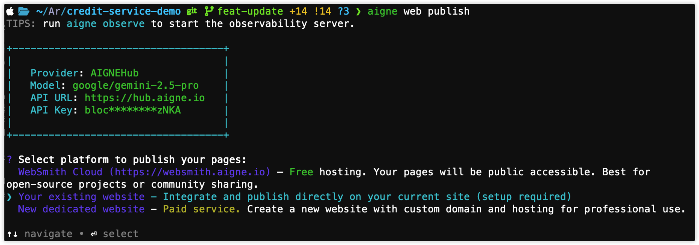
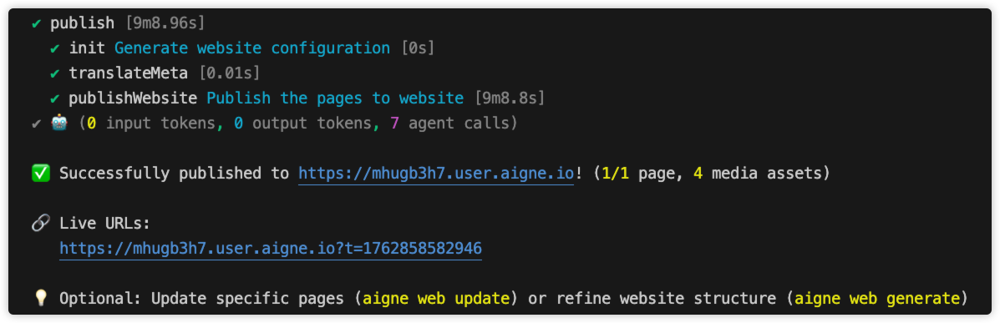

# 既存のウェブサイトへ

このガイドでは、`aigne web publish` を設定して、URL の入力やサービスの認可など、すでに運用している ArcBlock 上のサイトにデプロイする方法について説明します。

このガイドでは、生成されたウェブサイトコンテンツを、既存のウェブサイトインフラストラクチャに直接公開するための体系的な手順を説明します。この方法は、独自の ArcBlock 上のウェブサイトを管理しており、AIGNE WebSmith によって生成されたコンテンツを統合したいユーザーを対象としています。

カスタムウェブサイトへの公開により、ホスティングと統合を完全に制御できます。続行する前に、既存のウェブサイトに互換性があり、適切に設定されていることを確認してください。

## 前提条件

自身のウェブサイトに正常に公開するには、次の条件を満たす必要があります。

1.  **生成されたウェブサイト:** `aigne web generate` コマンドを使用して、ウェブサイトのページをすでに生成している必要があります。生成されたコンテンツは、プロジェクトの出力ディレクトリに存在している必要があります。
2.  **Blocklet Server を利用したウェブサイト:** ターゲットのウェブサイトは、実行中の Blocklet アプリケーションである必要があります。AIGNE WebSmith は、Blocklet Server 環境と直接統合します。
3.  **必須コンポーネント:** ターゲットのウェブサイトに **Pages Kit** コンポーネントがインストールされ、実行されている必要があります。このコンポーネントは、AIGNE WebSmith がコンテンツをアップロードおよび管理するために必要な API を提供します。

ウェブサイトがまだセットアップされていない場合は、Blocklet Store から必要なコンポーネントを入手できます。

- [あなたのウェブサイトに Pages Kit をインストールする](https://store.blocklet.dev/blocklets/z8iZiDFg3vkkrPwsiba1TLXy3H9XHzFERsP8o)

## 公開プロセス

公開プロセスには、コマンドの実行、適切なオプションの選択、ウェブサイトの URL の提供、そして AIGNE WebSmith CLI がサイトに接続するための認可が含まれます。

### ステップ 1: 公開コマンドの開始

プロジェクトディレクトリからターミナルで `publish` コマンドを実行して、プロセスを開始します。

```bash ウェブサイトを公開 icon=lucide:terminal
aigne web publish
```

### ステップ 2: 公開オプションの選択

公開先を尋ねられたら、**Your existing website** を選択します。



### ステップ 3: ウェブサイトの URL を提供

ターミナルのプロンプトで尋ねられたら、すでに Pages Kit が実行されているサイトの完全な URL を提供します。


### ステップ 4: 公開コマンドの認可

新しいウェブサイトへの初回接続時には、ターミナルコマンドがコンテンツを公開するためにあなたの認可を必要とします。これは、ウェブサイトごとに一度だけ行う設定プロセスです。

1.  **ブラウザ認証:** デフォルトのウェブブラウザが自動的にページを開き、公開コマンドにアクセスを許可できるようにします。
2.  **ログイン:** DID Wallet を使用してウェブサイトにログインするように求められます。
3.  **接続の承認:** ログイン後、「AIGNE WebSmith」からのサイトへのアクセス要求を承認する必要があります。この要求では、ページを管理するための権限が求められます。

承認されると、セキュアなアクセストークンが生成され、ホームディレクトリ (`~/.aigne/web-smith-connected.yaml`) にローカルで保存されます。このトークンは、この特定の URL への以降のすべての公開操作で使用されるため、認可ステップを繰り返す必要はありません。


### ステップ 5: 確認を待つ

認可後、ターミナルコマンドは次の処理に進みます。

1.  生成されたページファイルとアセットをバンドルします。
2.  参照されているすべてのメディアファイルをアップロードします。
3.  ページコンテンツをウェブサイトに公開します。

正常に完了すると、新しく公開されたページのライブ URL を含む確認メッセージがターミナルに表示されます。



## トラブルシューティング

公開プロセス中にエラーが発生した場合は、以下の一般的な問題を参照してください。

- **エラー: "The provided URL is not a valid website on ArcBlock platform"**
  - **原因:** 入力した URL が有効な Blocklet アプリケーションを指していません。
  - **解決策:** URL が正しいこと、およびウェブサイトが実行中であることを確認してください。正しいプロトコル（例: `https://`）を含んでいることを確認してください。

- **エラー: "This website does not have required components for publishing"**
  - **原因:** ターゲットのウェブサイトは有効な Blocklet ですが、必須の「Pages Kit」コンポーネントがありません。
  - **解決策:** Pages Kit コンポーネントをウェブサイトにインストールしてください。手順は[こちら](https://www.arcblock.io/docs/blocklet-development/en/add-components)で確認できます。

- **エラー: "Unable to connect" または "Failed to obtain access token"**
  - **原因:** これは通常、ネットワークの問題、またはターゲットサーバーが利用できないことを示します。また、ブラウザで認可要求を拒否した場合にも発生することがあります。
  - **解決策:** インターネット接続を確認し、ウェブサイトの URL が正しくアクセス可能であることを確認してから、`aigne web publish` コマンドを再実行し、認可要求を必ず承認してください。

---

公開が成功したら、コンテンツをさらに管理できます。既存のページに変更を加えるには、[ウェブサイトの更新](./guides-update-website.md)を参照してください。