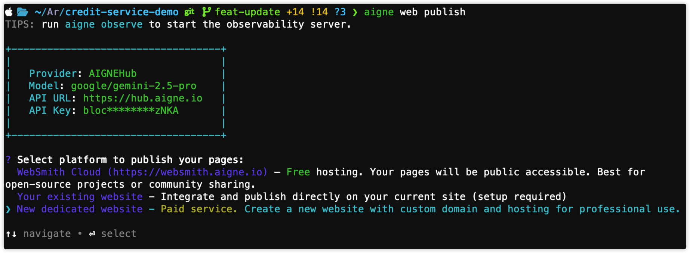
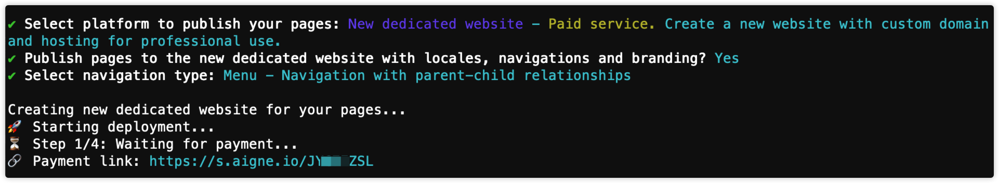
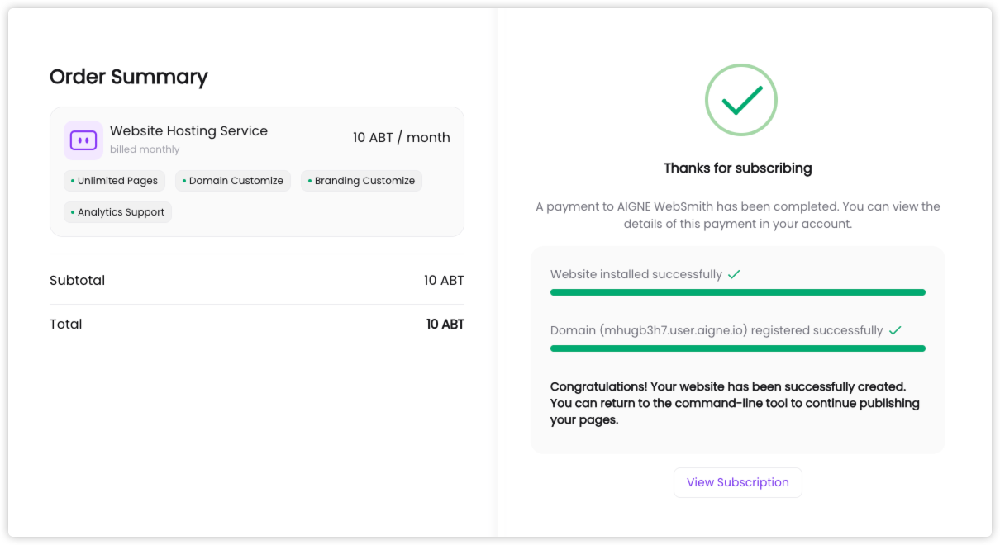
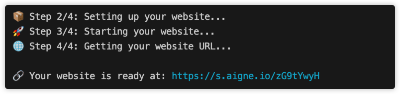

# 發布至新的專用網站

本指南將引導您完成付費的 `aigne web publish` 路徑，此路徑會佈建一個全新的託管網站，涵蓋付款流程，並可接續任何進行中的部署作業。

本指南為您提供一個系統化的流程，將您的內容發布到一個全新的專用網站。此選項是一項付費服務，為您的專案提供一個完全託管的環境，適用於需要自訂網域和專用資源的專業用途。

此流程是自動化的。當您啟動指令後，AIGNE WebSmith 將引導您完成一次性的設定與付款流程。完成後，您的網站將被建立，內容也會隨之發布。

## 流程概覽

發布至新的專用網站涉及一系列由 `publish` 指令處理的自動化步驟。該指令會與部署服務介接，以佈建並設定所有必要的資源。

工作流程如下：

1.  **啟動**：使用者執行 `aigne web publish` 指令。
2.  **選項選擇**：使用者在互動式提示中選擇「新的專用網站」選項。
3.  **確認資產**：系統會提示使用者確認是否在部署中包含品牌、導覽和語系設定。
4.  **付款與佈建**：使用者會被導向至一個安全的網頁以完成付款。系統接著會自動設定網站託管與環境。
5.  **內容部署**：AIGNE WebSmith 會將產生的頁面上傳並發布至新建立網站上的一個預設專案。
6.  **確認**：使用者會收到新網站的線上網址。

## 逐步說明

請確實遵循以下步驟來發布您的網站。

### 1. 啟動發布指令

首先，請確保您已使用 `aigne web generate` 指令產生了網站頁面。一旦您的內容在輸出目錄中準備就緒，請在您的終端機中執行以下指令：

```bash 發布網站 icon=lucide:terminal
aigne web publish
```

### 2. 選擇發布選項

當終端機列出發布目標時，選擇 **新的專用網站** 並確認。


### 3. 確認額外資產

選擇專用選項後，終端機會詢問是否要包含語系、導覽和品牌。接受預設的「是」，這樣您的新網站啟動時就會是完整配置的狀態。



### 4. 完成設定與付款

選擇選項後，自動化設定流程將開始：

1.  **付款**：您的終端機將顯示一則訊息，表示付款流程正在啟動。一個安全的付款連結將在您的預設網頁瀏覽器中開啟。


2.  **佈建**：付款完成後，WebSmith 會自動接續作業。終端機會等待服務被佈建、啟動和驗證——您無需採取任何進一步行動。



3.  **完成**：設定完成後，終端機會顯示線上網址以及一個訂閱管理連結。




### 5. 授權託管服務

在 WebSmith 上傳內容之前，請批准發布權限請求。終端機會啟動一個瀏覽器，您授予存取權限後，產生的權杖將被儲存以供未來執行時使用。


### 6. 自動發布內容

一旦網站佈建完成且授權成功，AIGNE WebSmith 將自動上傳您產生的頁面和媒體資產。


## 接續未完成的設定

如果先前曾嘗試建立專用網站但未完成（例如，放棄了付款流程），系統將會儲存該次的工作階段詳細資訊。當您下次執行 `aigne web publish` 時，您會看到一個額外的選項，讓您接續該流程。

```text
? Select platform to publish your pages:
  WebSmith Cloud (https://websmith.aigne.io) – Free hosting...
  Your existing website - ...
❯ Resume previous website setup - Already paid. Continue where you left off. Your payment has already been processed.
  New dedicated website - Paid service...
```

選擇這個「接續」選項，您可以從上次中斷的地方繼續，如果款項已處理，則無需重新開始或再次付款。系統將使用已儲存的 `checkoutId` 來還原先前的工作階段並完成網站設定。

## 總結

您已成功將您的專案發布到一個全新的專用網站。您的內容現在已上線，並可透過提供的網址存取。若要進行變更，您可以使用 `aigne web update` 來更新內容，或使用 `aigne web generate` 重新產生整個網站結構，然後再次執行 `aigne web publish` 指令。系統將使用已儲存的設定將更新發布到同一個網站。