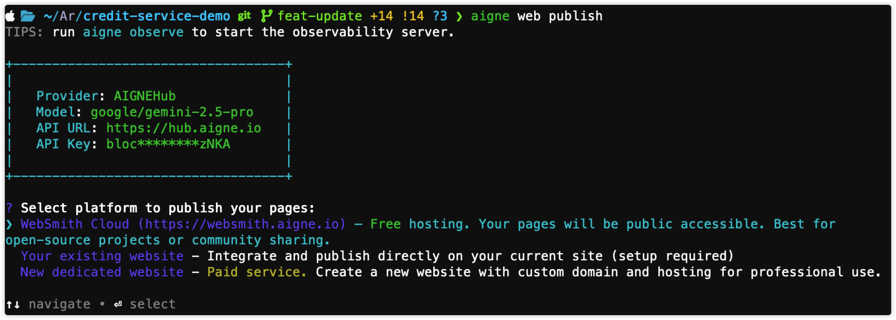

# To WebSmith Cloud

This guide walks you through publishing to WebSmith Cloud—a free hosting service that makes your website publicly accessible without managing any infrastructure. It's the recommended starting point for new users and perfect for open-source projects, portfolios, or community-focused sites.

## Prerequisites

Before proceeding with the publication process, ensure that you have already generated your website's pages. If you have not completed this step, please do so by running the following command:

```bash Generate Website icon=lucide:terminal
aigne web generate
```

## Publishing Procedure

The publishing process is initiated through a single command. The system will then guide you through the necessary selections and authorizations.

### Step 1: Execute the Publish Command

Open your terminal, navigate to your project's root directory, and execute the `publish` command.

```bash Publish Website icon=lucide:terminal
aigne web publish
```

You can also use the aliases `pub` or `p`.

### Step 2: Select the Publishing Platform

After executing the command, you will be presented with a list of publishing options. Select **WebSmith Cloud** to use the free hosting option.



### Step 3: Authorize AIGNE WebSmith (First-Time Setup Required)

If this is your first time publishing to WebSmith Cloud, the command-line tool needs to be authorized to publish on your behalf. This is a one-time security procedure.

1.  A secure authentication URL will automatically open in your default web browser.
2.  You will be prompted to log in to your account and approve the connection request from "AIGNE WebSmith".
3.  Once you approve, you can close the browser tab and return to the terminal.

The tool will securely store your authorization credentials, so you will not need to repeat this step for subsequent publications.


### Step 4: Await Publication

The terminal now handles the entire publication process automatically. This includes:

- Bundling your page and content files.
- Uploading all associated media assets.
- Deploying the files to the WebSmith Cloud servers.

This process may take a few minutes, depending on the size of your website.

## Reviewing Your Live Website

Upon successful completion, the terminal displays a confirmation message. This message includes the total number of pages and assets published, along with the direct URLs to access your live website.


You can now visit these URLs in your web browser to view your published website.

---

You have successfully published your website to WebSmith Cloud. If you need to make changes, you can modify your content and run the `publish` command again, or use the `update` command for more specific modifications. For more details, see [Update Website](./guides-update-website.md).

For alternative deployment targets, refer to the following guides:

- [To Existing Website](./guides-publish-website-to-existing-website.md)
- [To New Dedicated Website](./guides-publish-website-to-new-dedicated-website.md)
