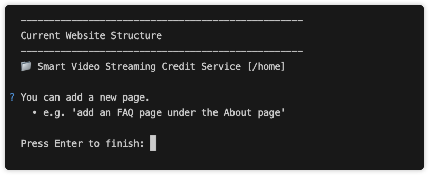
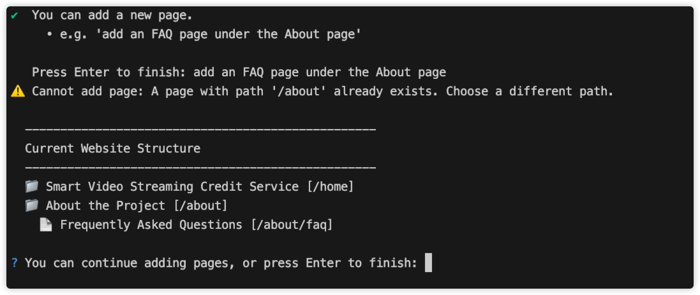

Expanding your website is straightforward with AIGNE WebSmith. This guide explains how to use the `aigne web add-page` command to seamlessly integrate new pages into your site's structure, automatically updating content and internal links.

# Add Page

The `aigne web add-page` command provides an interactive way to expand your website. It allows you to describe new pages in natural language, and WebSmith handles the process of creating the page, generating its content, and intelligently updating existing pages with relevant links to the new content.

## How It Works

When you run the command, WebSmith initiates an interactive session:

1.  **Displays Current Structure**: The command first prints the current sitemap so you have a clear overview of your existing pages.
2.  **Interactive Prompts**: You are prompted to describe the page you wish to add. You can specify the title, its location within the structure, and its purpose (e.g., "add a pricing page under the main services page").
3.  **Iterative Addition**: You can add multiple pages in a single session. After each addition, the tool displays the updated structure and prompts you for the next page. To finish, simply press Enter at an empty prompt.
4.  **Content Generation**: Once you finalize the structure, WebSmith generates the content for each new page based on your project's source materials.
5.  **Automatic Linking**: The tool analyzes your existing content to identify relevant places to insert links to your new pages, ensuring seamless navigation for your users.
6.  **Translation and Updates**: If your site uses multiple languages, the new pages and updated links are automatically included in the translation workflow.
7.  **Summary Report**: Finally, a summary is displayed, listing the new pages created and any existing pages that were updated with new links.

## Usage

To start adding pages, navigate to your project's root directory and run the following command:

```sh aigne web add-page icon=lucide:terminal
aigne web add-page
```

WebSmith will display your current website structure and prompt you to specify the new page you want to add.



For example, you could type:

```
add a 'Team' page under '/about'
```

WebSmith will process this request, update the structure, and display the result. If you attempt to add a page with a path that already exists, the system will notify you and prompt for a different path.



You can continue adding more pages or press Enter to confirm the changes and begin the content generation process.

## Summary

The `aigne web add-page` command simplifies the process of expanding your website. It combines interactive structure management with automated content generation and link integration, ensuring your site remains consistent and well-organized as it grows.

For related operations, see how to [Remove Page](./guides-update-website-remove-page.md) or perform more general content refinements with the [Update Page](./guides-update-website-update-page.md) command.