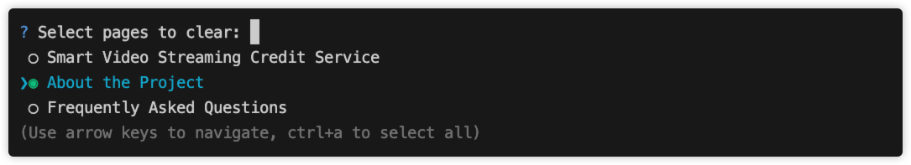
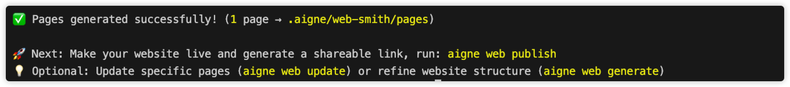

# 移除页面

需要清理您的网站结构吗？本指南将说明如何使用 `aigne web remove-page` 命令安全地删除页面，自动查找由此产生的任何损坏链接，并重新生成受影响的内容以保持网站的完整性。

## 概述

`remove-page` 命令提供了一种交互式的方式来从您的网站中移除一个或多个页面。此命令的一个关键特性是它能够检测并修复因删除页面而导致的损坏的内部链接。在您移除页面后，WebSmith 会自动扫描剩余内容，查找任何指向已删除页面的链接。然后，它会提示您重新生成受影响的页面，确保您网站的导航保持一致且无错误。

此过程通过防止用户遇到死链接，帮助您维护一个干净、专业的网站。

## 如何移除页面

要在您的终端中开始此过程，请运行以下命令：

```sh aigne web remove-page icon=lucide:terminal
aigne web remove-page
```

您也可以使用别名 `remove` 或 `rm`：

```sh aigne web rm icon=lucide:terminal
aigne web rm
```

### 第 1 步：选择要移除的页面

该命令将显示您当前网站结构中的所有页面列表。您可以使用箭头键浏览此列表，并通过按空格键选择希望移除的页面。



选择完所有想删除的页面后，按 `Enter` 键确认。如果您决定不移除任何页面，可以在未做任何选择的情况下按 `Enter` 键退出该过程。

### 第 2 步：自动链接修正（可选）

移除所选页面后，WebSmith 会扫描您剩余的页面，查找任何现在指向不存在内容的内部链接。

如果发现损坏的链接，您将看到一个受影响页面的列表。默认情况下，所有这些页面都会被选中以进行修复。您可以查看该列表并按 `Enter` 键，允许 WebSmith 重新生成这些页面，从而自动移除无效链接。如果您希望手动处理损坏的链接，可以取消选择所有页面以跳过此步骤。

### 第 3 步：查看摘要

该过程完成后，终端中将显示一个摘要。该摘要提供：

*   所有成功移除的页面的列表。
*   所有为修复损坏链接而重新生成的页面的列表。



这确保了您对网站结构和内容所做的所有更改都有清晰的记录。

## 总结

`aigne web remove-page` 命令是维护您网站结构的可靠工具。它不仅简化了删除页面的过程，还包含一个智能的链接检查功能，以保护您网站导航的完整性。

有关相关任务，请参阅以下指南：
<x-cards data-columns="2">
  <x-card data-title="添加页面" data-href="/guides/update-website/add-page" data-icon="lucide:file-plus">了解如何向您的网站结构中添加新页面。</x-card>
  <x-card data-title="更新页面" data-href="/guides/update-website/update-page" data-icon="lucide:file-pen-line">优化单个网页中的内容和细节。</x-card>
</x-cards>