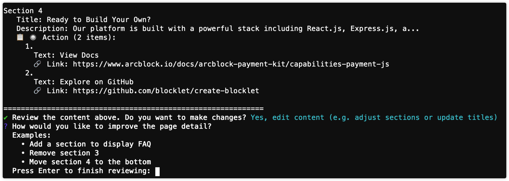

# 更新頁面

當您需要對單一頁面執行 `aigne web update` 指令時，請使用本指南。這包括重寫區塊、插入新模組、重新排序區塊或刪除過時內容，而不會更改網站的其餘部分。

此過程與修改整體網站地圖不同。有關新增、移除或重新組織頁面的說明，請參閱 [更新結構](./guides-update-website-update-structure.md) 指南。

## 更新流程

內容更新是使用 `aigne web update` 指令啟動的。此過程是互動式的，讓您能以自然語言提供回饋，WebSmith 隨後會將其轉換為對所選頁面的結構化變更。

```bash 更新頁面 icon=lucide:terminal
aigne web update
```

此指令也可以使用其別名 `up` 來調用。

標準工作流程如下：

1.  **執行指令**：執行 `aigne web update`。
2.  **選擇頁面**：WebSmith 會顯示現有頁面的列表。選擇您想要修改的單一頁面。
3.  **提供回饋**：輸入自然語言指令，描述您想做的變更。例如，「將英雄區塊的標題改為『即時 AI 網站』」或「在『優勢』之後新增一個三欄式的功能區塊。」
4.  **處理中**：WebSmith 會分析您的請求，並使用其更新工具將變更應用於頁面的內容結構。
5.  **檢視並儲存**：更新後的頁面內容會被儲存。您可以重新生成或發佈以查看新文案反映在渲染後的頁面中。



## 指令參數

對於非互動式或腳本化使用，您可以直接將回饋和其他參數作為命令列參數提供。

<x-field-group>
  <x-field data-name="--pages" data-type="array">
    <x-field-desc markdown>指定一個或多個要更新的頁面路徑。如果未提供，WebSmith 會提示您以互動方式選擇頁面。</x-field-desc>
  </x-field>
  <x-field data-name="--feedback" data-type="string">
    <x-field-desc markdown>直接提供內容回饋。對於腳本化更新很有用。</x-field-desc>
  </x-field>
  <x-field data-name="--glossary" data-type="string">
    <x-field-desc markdown>一個術語詞彙表，以確保內容生成過程中的術語一致性。您可以使用 `@<file>` 語法提供檔案路徑。</x-field-desc>
  </x-field>
</x-field-group>

## 內容修改能力

更新工作流程使用基於工具的操作。將您的回饋與這些能力對齊，以獲得可預測的結果。

| 操作 | 描述 | 回饋範例 |
| :--- | :--- | :--- |
| **新增區塊** | 新增一個內容區塊。指定內容及其位置。 | 「在『功能』之後新增一個『客戶』區塊，包含三個推薦證言。」 |
| **刪除區塊** | 依名稱移除現有區塊。 | 「移除『舊版支援』區塊。」 |
| **更新區塊** | 修改區塊內的內容。 | 「在『定價』區塊中，將標題改為『為團隊提供可預測的定價』。」 |
| **移動區塊** | 重新排序區塊。 | 「將『常見問題』移動到最後的行動呼籲（CTA）之前。」 |
| **更新元資料** | 更新頁面的元資料，如標題或描述。 | 「將頁面標題設定為『平台總覽』。」 |

## 回饋提示範例

```text 回饋範例 icon=lucide:clipboard-list
"Add a four-step walkthrough section after the hero for onboarding instructions."

"Remove the case-study section that references Legacy API clients."

"Change the CTA in the hero to 'See it in action' and adjust the subheading to mention 5-minute setup."
```

## 總結

更新頁面內容是一個由清晰指令驅動的迭代過程。透過將您的回饋與 WebSmith 的頁面更新能力對齊，您可以快速優化文案、重新排序區塊，並在不影響網站其餘部分的情況下保持網站的準確性。

有關結構性變更，請參閱 [更新結構](./guides-update-website-update-structure.md) 指南。有關發佈更新，請瀏覽 [發佈網站](./guides-publish-website.md)。