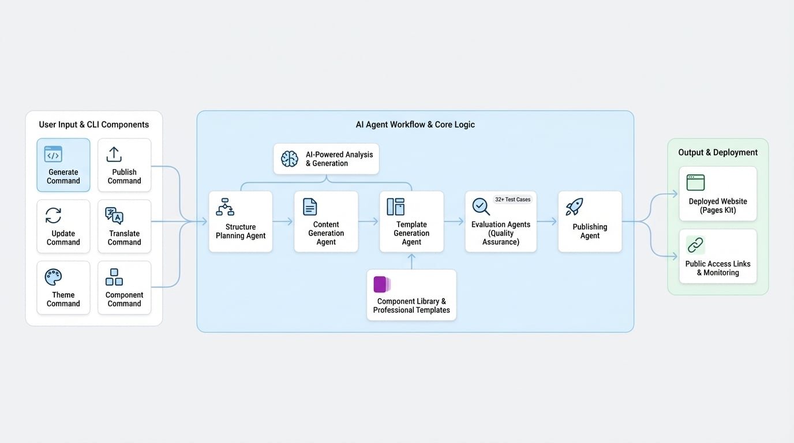

# 概述

本文档对 AIGNE WebSmith 进行了高层级的介绍。阅读完毕后，您将了解其核心目标、关键功能以及用于自动化创建专业网站（从初始规划到最终发布）的基础工作流程。

AIGNE WebSmith 是一款由 AI 驱动的工具，可自动化创建经过 SEO 优化的专业网站。它能根据您提供的源材料生成完整的内容和模板，并可直接发布最终站点。该系统旨在简化整个 Web 开发流程，最大限度地减少手动工作和技术要求。

## 关键功能

WebSmith 提供了一套全面的功能，用于自动化网站的创建和管理。该系统围绕四大核心能力构建：AI 驱动的生成、专业的模板系统、质量保证和直接发布。

| 功能领域 | 描述 |
| :--- | :--- |
| **AI 驱动的生成** | 利用 AI 分析需求、规划最优站点结构、一次性为所有页面生成详细内容，并应用 SEO 最佳实践。支持中英文内容生成。 |
| **专业模板** | 创建与 Pages Kit 兼容的模板，采用基于组件的设计，包含 Hero、CTA 和 FAQ 等元素。模板具有响应式特性，能适配移动和桌面显示。 |
| **质量保证** | 包含一个自动化评估系统，用于评估网站架构、用户体验和内容一致性。该系统由一套超过 32 个覆盖核心功能的测试用例支持。 |
| **一键发布** | 支持将多页面网站直接批量发布到 Pages Kit。它提供状态监控，并在成功部署后立即提供公共访问链接。 |

## 工作原理

WebSmith 采用一系列专业的 AI Agent 顺序工作，以构建和部署网站。每个 Agent 负责流程中的一个特定阶段，确保从构思到发布的整个工作流程结构化且可靠。

下图展示了这一顺序流程：

<!-- DIAGRAM_IMAGE_START:architecture:16:9 -->

<!-- DIAGRAM_IMAGE_END -->

流程如下：

1.  **结构规划**：一个 Agent 分析您的项目需求，以设计一个智能且逻辑清晰的网站架构。
2.  **内容生成**：基于规划好的结构，另一个 Agent 为每个页面生成高质量的相关内容。
3.  **模板生成**：第三个 Agent 获取生成的内容，并将其组装成专业的、基于组件的模板。
4.  **评估与发布**：最后，在发布 Agent 上传已完成的网站之前，评估 Agent 会对输出质量进行评估。

这种模块化的、基于 Agent 的架构确保每一步都由专门的流程处理，从而产出一致且高质量的最终产品。

## 核心组件

WebSmith 的功能通过一组独特的命令行界面 (CLI) 命令提供。每个命令对应系统中的一个核心组件或工作流程。

<x-cards data-columns="2">
  <x-card data-title="生成" data-icon="lucide:bot" data-href="/guides/create-website">
    根据用户定义的需求，生成包括结构和内容在内的完整网站。
  </x-card>
  <x-card data-title="发布" data-icon="lucide:rocket" data-href="/guides/publish-website">
    将生成的网站发布到各种目标，包括 WebSmith Cloud 或您自己的基础设施。
  </x-card>
  <x-card data-title="更新" data-icon="lucide:file-pen-line" data-href="/guides/update-website">
    根据新的反馈或需求，修改现有网站的内容或结构。
  </x-card>
  <x-card data-title="翻译" data-icon="lucide:languages" data-href="/guides/localize-website">
    将现有网站内容翻译成多种语言，如中文、日语、法语和德语。
  </x-card>
  <x-card data-title="主题" data-icon="lucide:palette" data-href="/guides/customize-theme">
    通过生成和应用不同的样式和配色方案来管理网站的视觉主题。
  </x-card>
  <x-card data-title="组件" data-icon="lucide:library" data-href="/advanced-features/use-custom-component-libraries">
    管理用于构建网站视觉元素的组件库。
  </x-card>
</x-cards>

## 总结

本概述介绍了 AIGNE WebSmith 的主要功能和架构。现在，您应该对 WebSmith 是什么、其主要功能以及用于与之交互的命令有了基本的了解。

对于后续步骤，我们建议您继续阅读[快速入门](./getting-started.md)指南，该指南提供了安装、配置和生成您第一个网站的分步教程。