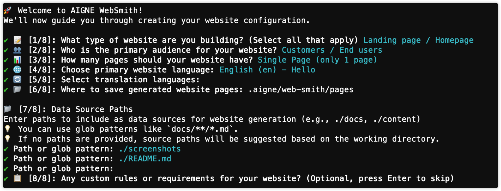

# Config 參考

`config.yaml` 檔案是您網站生成的核心控制面板。了解其設定可讓您自訂 AI 輸出的各個方面，從頁面結構到內容語氣。本指南提供了完整、逐欄位的參考，以協助您精確地修改您的網站。

## 總覽

`config.yaml` 檔案是 AIGNE WebSmith 的主要設定來源。它使用 YAML 格式來儲存 AI agent 生成您的網站所需的所有參數。每當您執行像 `generate` 或 `update` 這樣的指令時，WebSmith 都會讀取此檔案以了解您的需求。

-   **檔案名稱：** `config.yaml`
-   **位置：** `.aigne/web-smith/config.yaml` (相對於您專案的根目錄)
-   **格式：** YAML (UTF-8)

此檔案控制網站的用途、目標受眾、內容生成規則、頁面結構、多語言支援和部署設定。

### 建立與更新設定

當您首次使用 WebSmith 時，`config.yaml` 檔案會自動建立。

**建立：**

您可以透過兩種方式建立檔案：

1.  **在首次生成期間：** 在一個新專案中執行 `aigne web generate` 將會啟動一個互動式精靈來建立 `config.yaml` 檔案，然後再開始生成過程。
2.  **單獨建立：** 執行 `aigne web init` 會啟動同一個精靈來建立設定檔，但不會立即生成網站。

```sh aigne web init icon=lucide:terminal
aigne web init
```



**更新：**

您可以使用以下兩種方法之一來更新您的設定：

1.  **直接編輯檔案：** 在文字編輯器中開啟 `.aigne/web-smith/config.yaml` 並修改欄位。
2.  **使用互動式精靈：** 再次執行 `aigne web init`。精靈將載入您現有的設定並引導您進行更新。

## 設定參數

`config.yaml` 中的欄位被組織成功能群組。以下各節詳細說明了每個參數。

### 專案基礎

此群組定義了您專案的識別資訊，用於品牌、SEO 和社群媒體分享。

<x-field-group>
  <x-field data-name="projectName" data-type="string" data-required="true">
    <x-field-desc markdown>您專案的顯示名稱。它會出現在頁面標題 (`<title>`)、導覽列和其他品牌元素中。為求可讀性，請保持在 50 個字元以內。</x-field-desc>
  </x-field>
  <x-field data-name="projectDesc" data-type="string" data-required="true">
    <x-field-desc markdown>您專案的簡要描述，用於 SEO meta 描述 (`<meta name="description">`) 和社群分享預覽。目標是少於 150 個字元。</x-field-desc>
  </x-field>
  <x-field data-name="projectLogo" data-type="string" data-required="false">
    <x-field-desc markdown>您專案標誌的 URL 或本地路徑。它用於網站頁首、favicon 和社群媒體縮圖。支援完整 URL 或相對路徑（例如 `./assets/logo.png`）。</x-field-desc>
  </x-field>
  <x-field data-name="projectId" data-type="string" data-required="true">
    <x-field-desc markdown>一個唯一的 UUID，用於在 WebSmith 服務中識別您的專案。它是自動生成的，不應更改，因為這樣做會使您的專案與其部署歷史記錄脫鉤。</x-field-desc>
  </x-field>
  <x-field data-name="projectSlug" data-type="string" data-default="/" data-required="false">
    <x-field-desc markdown>您網站部署的 URL 路徑前綴。例如，`/docs` 的 slug 會將網站部署到 `https://example.com/docs/`。</x-field-desc>
  </x-field>
  <x-field data-name="projectCover" data-type="string" data-required="false">
    <x-field-desc markdown>用於社群媒體預覽（例如 Open Graph）的封面圖片路徑。請使用高品質圖片，建議尺寸為 1200×630 像素。</x-field-desc>
  </x-field>
</x-field-group>

### 網站策略

這些欄位定義了 AI 的高層次策略，影響網站的用途、內容語氣和整體結構。

<x-field-group>
  <x-field data-name="pagePurpose" data-type="array" data-required="true">
    <x-field-desc markdown>定義網站的主要目標，這會影響頁面結構和使用的元件。可能的值包括 `landingPage`、`ecommerce`、`saas`、`portfolio`、`corporate`、`blog`、`nonprofit` 和 `education`。</x-field-desc>
  </x-field>
  <x-field data-name="targetAudienceTypes" data-type="array" data-required="true">
    <x-field-desc markdown>指定目標受眾，這會影響 AI 的語氣、複雜性和範例。可能的值包括 `customers`、`businessOwners`、`marketers`、`designers`、`developers`、`investors`、`jobSeekers`、`students` 和 `generalPublic`。</x-field-desc>
  </x-field>
  <x-field data-name="websiteScale" data-type="string" data-default="standard" data-required="false">
    <x-field-desc markdown>控制頁面數量和導覽複雜度。選項有：`singlePage`（一個可滾動的頁面）、`minimal`（2-6 頁）、`standard`（7-12 頁，建議）、`comprehensive`（12 頁以上）或 `aiDecide`（讓 AI 決定）。</x-field-desc>
  </x-field>
  <x-field data-name="rules" data-type="string" data-required="false">
    <x-field-desc markdown>為 AI 提供關於內容結構、語氣和風格的詳細、多行指示。這是引導生成過程以符合您特定要求的關鍵欄位。支援 Markdown 格式。</x-field-desc>
  </x-field>
</x-field-group>

### 語言

設定主要語言以及任何用於翻譯的其他語言。

<x-field-group>
  <x-field data-name="locale" data-type="string" data-default="en" data-required="false">
    <x-field-desc markdown>網站基礎內容的主要語言，使用 IETF 語言代碼指定（例如 `en`、`zh`、`ja`）。</x-field-desc>
  </x-field>
  <x-field data-name="translateLanguages" data-type="array" data-required="false">
    <x-field-desc markdown>要將網站翻譯成的其他語言代碼列表。每個語言代碼都將生成一個完整的、已翻譯的網站結構版本。</x-field-desc>
  </x-field>
</x-field-group>

### 資料來源

這些欄位指定 AI agent 將用作參考資料的內容和資料。

<x-field-group>
  <x-field data-name="sourcesPath" data-type="array" data-required="true">
    <x-field-desc markdown>供 AI 分析的本地目錄和檔案路徑陣列。**這是影響內容品質最重要的欄位**，因為 AI 僅使用這些來源作為參考。請包含文件、READMEs 和其他關鍵專案檔案。</x-field-desc>
  </x-field>
  <x-field data-name="defaultDatasources" data-type="array" data-required="false">
    <x-field-desc markdown>一個檔案路徑陣列，這些檔案會被注入到每個頁面的上下文中。這對於共享資料很有用，例如列出圖片位置和描述的 `media.md` 檔案。</x-field-desc>
  </x-field>
</x-field-group>

### 輸出與部署

設定輸出目錄和部署 URL。

<x-field-group>
  <x-field data-name="pagesDir" data-type="string" data-default="./aigne/web-smith/pages" data-required="false">
    <x-field-desc markdown>儲存生成的網站檔案（例如 `page.yaml`）的輸出目錄。</x-field-desc>
  </x-field>
  <x-field data-name="appUrl" data-type="string" data-required="false">
    <x-field-desc markdown>您網站的最終部署 URL。`publish` 指令會使用此 URL 來確定部署目標。</x-field-desc>
  </x-field>
</x-field-group>

### 媒體與顯示

這些設定控制如何處理像圖片這樣的媒體資產。

<x-field-group>
  <x-field data-name="media.minImageWidth" data-type="integer" data-default="800" data-required="false">
    <x-field-desc markdown>圖片被考慮用於網站的最小寬度（以像素為單位）。這有助於過濾掉低品質或小尺寸的圖片。</x-field-desc>
  </x-field>
</x-field-group>

### 系統管理欄位

這些欄位通常由 WebSmith 管理，不需要手動編輯。

<x-field-group>
  <x-field data-name="lastGitHead" data-type="string" data-required="false">
    <x-field-desc markdown>上次生成的 Git commit 雜湊值，用於增量更新。</x-field-desc>
  </x-field>
  <x-field data-name="checkoutId" data-type="string" data-required="false">
    <x-field-desc markdown>開發期間使用的暫時性變數。</x-field-desc>
  </x-field>
  <x-field data-name="shouldSyncAll" data-type="string" data-required="false">
    <x-field-desc markdown>開發期間使用的暫時性變數。</x-field-desc>
  </x-field>
  <x-field data-name="navigationType" data-type="string" data-required="false">
    <x-field-desc markdown>開發期間使用的暫時性變數。</x-field-desc>
  </x-field>
</x-field-group>

## 套用變更

對 `config.yaml` 檔案的變更不會自動套用。您必須執行適當的指令才能讓您的修改生效。所需的指令取決於您變更了哪個欄位。

| 欄位                                                                        | 套用變更的指令                                 | 備註                                                                |
| :-------------------------------------------------------------------------- | :----------------------------------------------------- | :------------------------------------------------------------------ |
| `pagePurpose`, `targetAudienceTypes`, `websiteScale`, `locale`              | `aigne web clear && aigne web generate`                | 這些需要完全重新生成才能正確地重組網站。                            |
| `rules`, `media.minImageWidth`, `defaultDatasources`                        | `aigne web update`                                     | 更新現有內容而無需完全重新生成。                                    |
| `sourcesPath`                                                               | `aigne web clear && aigne web generate` 或 `aigne web update` | 在更新期間會分析新的來源以改善內容。                                |
| `translateLanguages`                                                        | `aigne web translate`                                  | 根據更新的列表新增新的語言版本。                                    |
| `projectName`, `projectDesc`, `projectLogo`, `projectCover`, `appUrl` | `aigne web publish`                                    | 這些欄位主要在發布過程中被使用。                                    |

## 完整設定範例

以下是 AIGNE WebSmith 專案本身的完整 `config.yaml` 檔案，展示了一個真實世界的設定。

```yaml config.yaml
projectName: AIGNE WebSmith
projectDesc: "AI-powered website generation tool built on the AIGNE Framework"
projectLogo: https://www.arcblock.io/content/uploads/2e5edbac4a7d5310c117d09601811c.png
projectId: pg4d0000-0000-4000-a000-000000000000
projectSlug: /
pagePurpose:
  - landingPage
targetAudienceTypes:
  - customers
websiteScale: singlePage
rules: |
  ### I. 核心訊息與策略：定義您向使用者傳達 *什麼* 的基礎元素。
  1. 在「首屏」回答關鍵問題：使用者看到的第一個畫面必須清晰且立即回答：
    * 這是什麼：產品的簡潔描述。
    * 適用對象：特定的目標受眾（例如，獨立創業者、小型團隊）。
    * 為何與眾不同：您獨特的價值主張（例如，「開放、可組合、可匯出的程式碼、agent 工作流程」）。
    * 主要行動：一個單一、清晰的行動呼籲（CTA），與使用者的主要目標一致。
  2. 用證據建立信譽：不要期望使用者相信您的說法。在敘述的早期向他們展示證據。
    * 展示，而不僅僅是告知：最有力的證據是示範。包含一個短的（30-45秒）無聲影片循環，或一個連結到用該工具建立的真實網站。
    * 使用社會證明：在解釋「如何運作」之前，插入具體的證據，如客戶標誌、一個引人注目的數據點（例如，「超過 50 個團隊使用」），或一個強而有力的使用者引述。
  3. 定義一個清晰的行動呼籲（CTA）：
    * 使 CTA 與受眾一致：主要的 CTA 應該是您希望目標使用者採取的主要行動（例如，「生成我的網站」）。
    * 優先處理 CTA：將次要行動（如「在 GitHub 上查看」）放在較不顯眼的位置（次要按鈕或頁尾連結），特別是對於非開發者受眾。
    * 在行動裝置上保持一個持續的 CTA：在行動裝置上，一個主要 CTA 應該始終可見。
locale: en
translateLanguages:
  - zh
  - zh-TW
  - ja
pagesDir: .aigne/web-smith/pages
sourcesPath:
  - ./assets/documents
  - ./README.md
  - ./aigne.yaml
  - ./assets/images
  - ./assets/recordings/README.md
  - ./CHANGELOG.md
  - ./agents
defaultDatasources:
  - ./media.md
media:
  minImageWidth: 600
lastGitHead: c4a4d3db4bf230e2c6873419e26b6654c39613a5
checkoutId: ""
projectCover: .aigne/web-smith/cover.png
shouldSyncAll: ""
navigationType: ""
appUrl: https://mhevtaeg.user.aigne.io
```

## 總結

掌握 `config.yaml` 檔案讓您能完全控制網站生成過程。透過仔細定義您的專案基礎、網站策略和資料來源，您可以引導 AI 產出高品質、相關且客製化的網站。

如需更多實作指導，請參閱以下指南：

<x-cards data-columns="3">
  <x-card data-title="建立網站" data-icon="lucide:rocket" data-href="/guides/create-website">學習從零開始生成您第一個網站的完整工作流程。</x-card>
  <x-card data-title="準備材料" data-icon="lucide:folder-check" data-href="/reference/prepare-materials">了解如何準備您的來源文件以獲得最佳結果。</x-card>
  <x-card data-title="疑難排解" data-icon="lucide:wrench" data-href="/reference/trouble-shooting">尋找常見設定和生成問題的解決方案。</x-card>
</x-cards>