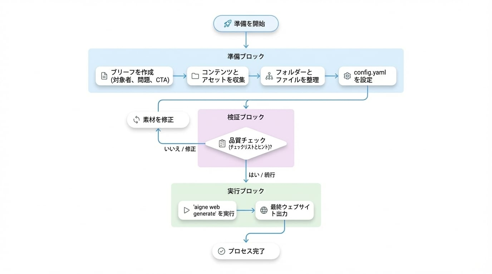

# 資料の準備

優れたウェブサイトは、`aigne web generate` を実行する前から始まります。このガイドでは、WebSmith があなたの要件を反映し、適切な証拠を引用し、修正サイクルを少なくできるページを構築できるよう、ブリーフ、ソースドキュメント、証明資料を収集するための具体的なチェックリストを提供します。

## 準備のワークフロー

資料収集から最初のウェブサイトができるまでのプロセスの流れは以下の通りです。

<!-- DIAGRAM_IMAGE_START:flowchart:16:9:1765348253 -->

<!-- DIAGRAM_IMAGE_END -->

各ステップは前のステップに基づいています。より良いインプットが、より良いアウトプットを生み出します—それほど単純なことです。整理されたコンテンツキットは、WebSmith が最初から権威があり、ブランドに沿ったページを作成するのに役立ちます。

## ステップ 1. 基本から始める

以下の4つの質問に答える短いブリーフを作成します。シンプルな Markdown や Word ドキュメントで十分です。

| 質問 | なぜ重要か | 例 |
| :---------------- | :-------------------------------------------------------------------------------------------------- | :---------------------------------------------------------------------- |
| **オーディエンス** | トーン、語彙、証明資料は、ページの読者に合わせる必要があります。 | 「成長段階のフィンテック創業者とそのエンジニアリングリーダー。」 |
| **課題** | 解決する課題を明確にします。 | 「手動のオンボーディングにより、10時間以上の反復的なコンプライアンスレビューが発生している。」 |
| **差別化要因** | コピーが競合他社と同じように聞こえるのを防ぎます。 | 「地域のデータレイク上に構築された KYC + KYB 自動化を備えた唯一のプラットフォーム。」 |
| **主要な CTA** | すべてのセクションを単一のコンバージョンアクションに向けます。 | 「20分間のインテグレーションレビューを予約する。」 |

このファイルをプロジェクト内に保存し、`sourcesPath` に追加できるようにします。

## ステップ 2. コンテンツとアセットを収集する

WebSmith はあなたが提供したもので動作します。関連性の高い資料を提供すればするほど、ウェブサイトの品質は向上します。これらのアイテムを `sources` ディレクトリに整理してください。

### 推奨されるコンテンツタイプ

| コンテンツタイプ | 説明 | 例 |
| :-------------------- | :--------------------------------------------------------------------------------------------------------------------------------------- | :---------------------------------------------------------------------------- |
| **製品ドキュメント** | 機能の内訳、アーキテクチャメモ、API リファレンス、価格説明。 | `docs/product-overview.md`, `api/quickstart.md` |
| **マーケティングプラン** | ポジショニング、メッセージングハウス、キャンペーンブリーフ、競合他社の概要。 | `marketing/positioning.pdf`, `brand/voice.md` |
| **事業計画** | ミッション、ビジョン、ロードマップ、資金調達のマイルストーン、リーダーシップの経歴。 | `company/mission.txt`, `investor/roadmap.pptx` |
| **既存のコンテンツ** | ブログ投稿、FAQ、変更履歴など、トーンや繰り返し語られるストーリーを示すもの。 | `blog/*.md`, `faq.md`, `release-notes/2024-02.md` |
| **メディアファイル** | ロゴ、製品のスクリーンショット、チームの写真、チャート。 | `assets/logo.svg`, `screenshots/dashboard.png` |

### サポートされているフォーマット

| カテゴリ | フォーマット |
| :------------ | :--------------------------------------------------------------------------------------------------------- |
| **テキスト** | `.md`, `.txt`, `.html`, `.json`, `.yaml`, `.xml` |
| **ドキュメント** | `.pdf`, `.doc`, `.docx`, `.xls`, `.xlsx`, `.ppt`, `.pptx` |
| **画像** | `.jpg`, `.jpeg`, `.png`, `.gif`, `.svg`, `.webp` |
| **コード** | `.js`, `.ts`, `.py`, `.go`, `.rs`, `.java`、およびスニペット抽出用の他のほとんどの主流言語 |

## ステップ 3. 明確さのために整理する

ファイルを論理的にグループ化します。これにより、あなたと WebSmith の両方が必要なものを簡単に見つけられるようになります。

```sh project-sources/ icon=lucide:folder-tree
project-sources/
├── 01_briefs/
│   ├── product-overview.md
│   └── audience-matrix.md
├── 02_proof/
│   ├── testimonials.md
│   └── security-metrics.xlsx
├── 03_assets/
│   ├── logo.svg
│   └── dashboard.png
└── 04_content/
    ├── blog/
    └── faq.md
```

説明的なフォルダ名とプレフィックスを使用してください。各ディレクトリに何が含まれているかが一目でわかるようにする必要があります。

## ステップ 4. `config.yaml` でソースを接続する

`sourcesPath` 配列を、先ほど整理したディレクトリ（または特定のファイル）に向けます。これは最も重要な設定パラメータです。

```yaml config.yaml icon=lucide:file-code
sourcesPath:
  - ./project-sources/01_briefs
  - ./project-sources/02_proof
  - ./project-sources/03_assets
pagePurpose:
  - saas
targetAudienceTypes:
  - businessOwners
  - developers
rules: >
  顧客の引用に裏付けられた40%のコスト削減を強調する。SOC 2 + ISO 27001に言及する。
```

`aigne web generate` を実行すると、WebSmith はこれらのフォルダを再帰的に読み取り、ファイルをチャンク化し、コピーを書き込み、レイアウトを組み立てる際にそれらを引用します。

## アプローチを選択する

どれくらいの時間がありますか？あなたの状況に合ったアプローチを選んでください。

### クイックスタート：デモが必要なだけですか？

すぐに何かを立ち上げて、後で洗練させたい場合に最適です。

- よく書かれた README（約500語以上）といくつかのスクリーンショットから始める
- それらを `sourcesPath` に追加する
- `aigne web generate` を実行し、結果を確認して一度イテレーションする
- プロトタイプ、内部デモ、または様子見に最適

### 推奨：本格的なものを構築する

これは、実際の製品やサービスをローンチするほとんどのチームにとって最適な方法です。

1. **オーディエンス**、**課題**、**差別化**、**CTA** を文書化する
2. 各ペルソナに対して、機能的および感情的な証明を含む価値マトリックスを構築する
3. WebSmith に執筆させる前に、各ページのセクションを意図ごとにアウトライン化する
4. お客様の声、メトリクス、スクリーンショットを別々のファイルとしてパッケージ化する
5. 生成後、各セクションが目標を達成しているかを確認し、洗練させて再実行する

### 上級：チームのナレッジベース

複数のサイトを出荷したり、長期的なコンテンツシステムを維持したりするチーム向けです。

- 専門知識をトピックごとに整理された、焦点を絞った Markdown ファイルに分割する
- 構造の例：

```sh
knowledge-base/
├── foundation/
│   ├── mission.md
│   └── brand-voice.md
├── products/
│   ├── payments-overview.md
│   └── payments-technical-specs.md
├── proof-points/
│   ├── case-study-fintech-x.md
│   └── g2-reviews.md
└── audiences/
    ├── developer-persona.md
    └── operator-persona.md
```

このアプローチは美しくスケールします：
- 異なるプロジェクトのためにディレクトリを組み合わせる
- すべてのサイトが単一の情報源からデータを取得する
- 1つのファイル（`case-study-fintech-x.md`）を更新すると、それを参照するすべてのウェブサイトが自動的に改善される

## 品質チェックリスト

generate を実行する前に、以下を確認してください。

- [ ] すべての主張が、ソースファイル内のデータポイント、引用、またはメトリクスによって裏付けられている
- [ ] ペルソナと CTA がマーケティングコピーとは別に文書化されている
- [ ] アセットには説明的な名前が付いている（`image1.png` ではなく `dashboard-dark.png`）
- [ ] 機密ファイルや内部専用ファイルは除外されている（WebSmith は指定したすべてを読み取ります）
- [ ] ソースドキュメントには知識が含まれ、スタイルのガイダンスは `rules` フィールドに入れる

## 最良の結果を得るためのヒント

WebSmith は一度の実行で優れたウェブサイトを生成するように設計されていますが、その品質はあなたが提供するものに依存します。

- **具体的な詳細を提供する。** ソース資料（データポイント、引用、メトリクス）が具体的であればあるほど、ウェブサイトはより権威あるものになります。
- **コンテンツを焦点を絞ったファイルに分割する。** 1つの巨大なドキュメントではなく、トピックを小さなファイルに整理します。これにより、WebSmith はソースを正確に引用し、より構造化されたコンテンツを生成しやすくなります。
- **コンテンツと指示を分離する。** 知識はソースファイルに入れ、レイアウトやトーンの指示は `rules` フィールドに記述します。

## 次のステップ

<x-cards data-columns="3">
  <x-card data-title="はじめに" data-icon="lucide:rocket" data-href="/getting-started">
    AIGNE CLI をインストールし、`aigne web generate` を実行して、最初のサイトを確認します。
  </x-card>
  <x-card data-title="ウェブサイトの作成" data-icon="lucide:wrench" data-href="/guides/create-website">
    generate ワークフローで利用可能なすべてのオプションを学びます。
  </x-card>
  <x-card data-title="ウェブサイトの公開" data-icon="lucide:globe" data-href="/guides/publish-website">
    コンテンツが良くなったら、WebSmith Cloud または独自のインフラストラクチャにデプロイします。
  </x-card>
</x-cards>
