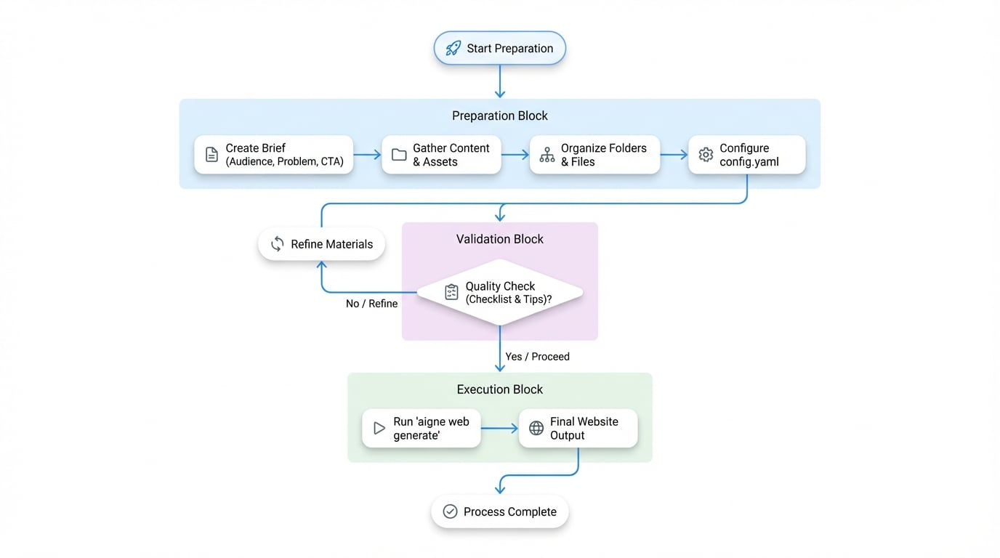

# Prepare Materials

Great websites start before you run `aigne web generate`. This guide gives you a concrete checklist for collecting briefs, source docs, and proof so WebSmith can build pages that reflect your requirements, cite the right evidence, and require fewer revision cycles.

## The preparation workflow

Here's how the process flows from gathering materials to getting your first website:

<!-- DIAGRAM_IMAGE_START:flowchart:16:9 -->

<!-- DIAGRAM_IMAGE_END -->

Each step builds on the previous one. Better inputs mean better output—it's that simple. A well-organized content kit helps WebSmith create authoritative, on-brand pages from the start.

## Step 1. Start with the essentials

Create a short brief that answers these four questions. A simple Markdown or Word doc works perfectly:

| Question          | Why it matters                                                                                      | Example                                                                 |
| :---------------- | :-------------------------------------------------------------------------------------------------- | :---------------------------------------------------------------------- |
| **Audience**      | Tone, vocabulary, and proof should match who will read the page.                                    | "Growth-stage fintech founders and their engineering leads."            |
| **Problem**       | Forces clarity on the pain you solve.                                                               | "Manual onboarding creates 10+ hours of repetitive compliance reviews." |
| **Differentiator**| Keeps the copy from sounding like every competitor.                                                 | "Only platform with KYC + KYB automation built on regional data lakes." |
| **Primary CTA**   | Aligns every section toward a single conversion action.                                             | "Book a 20-minute integration review."                                  |

Save this file inside the project so you can add it to `sourcesPath`.

## Step 2. Gather your content and assets

WebSmith works with what you give it. The more relevant material you provide, the better your website will be. Organize these items into a `sources` directory:

### Recommended content types

| Content Type          | Description                                                                                                                              | Example                                                                       |
| :-------------------- | :--------------------------------------------------------------------------------------------------------------------------------------- | :---------------------------------------------------------------------------- |
| **Product Documents** | Feature breakdowns, architecture notes, API references, pricing explanations.                                                            | `docs/product-overview.md`, `api/quickstart.md`                               |
| **Marketing Plans**   | Positioning, messaging house, campaign briefs, competitor summaries.                                                                     | `marketing/positioning.pdf`, `brand/voice.md`                                 |
| **Business Plans**    | Mission, vision, roadmap, funding milestones, leadership bios.                                                                            | `company/mission.txt`, `investor/roadmap.pptx`                                |
| **Existing Content**  | Blog posts, FAQs, changelogs - anything that shows tone or repeatable stories.                                                           | `blog/*.md`, `faq.md`, `release-notes/2024-02.md`                             |
| **Media Files**       | Logos, product screenshots, team photos, charts.                                                                                          | `assets/logo.svg`, `screenshots/dashboard.png`                                |

### Supported formats

| Category      | Formats                                                                                                    |
| :------------ | :--------------------------------------------------------------------------------------------------------- |
| **Text**      | `.md`, `.txt`, `.html`, `.json`, `.yaml`, `.xml`                                                           |
| **Documents** | `.pdf`, `.doc`, `.docx`, `.xls`, `.xlsx`, `.ppt`, `.pptx`                                                  |
| **Images**    | `.jpg`, `.jpeg`, `.png`, `.gif`, `.svg`, `.webp`                                                           |
| **Code**      | `.js`, `.ts`, `.py`, `.go`, `.rs`, `.java`, plus most other mainstream languages for snippet extraction    |

## Step 3. Organize for clarity

Group your files logically. This makes it easy for both you and WebSmith to find what's needed.

```sh project-sources/ icon=lucide:folder-tree
project-sources/
├── 01_briefs/
│   ├── product-overview.md
│   └── audience-matrix.md
├── 02_proof/
│   ├── testimonials.md
│   └── security-metrics.xlsx
├── 03_assets/
│   ├── logo.svg
│   └── dashboard.png
└── 04_content/
    ├── blog/
    └── faq.md
```

Use descriptive folder names and prefixes. It should be obvious at a glance what each directory contains.

## Step 4. Connect your sources in `config.yaml`

Point the `sourcesPath` array at the directories (or specific files) you just organized. This is the single most important configuration parameter.

```yaml config.yaml icon=lucide:file-code
sourcesPath:
  - ./project-sources/01_briefs
  - ./project-sources/02_proof
  - ./project-sources/03_assets
pagePurpose:
  - saas
targetAudienceTypes:
  - businessOwners
  - developers
rules: >
  Highlight 40% cost savings backed by customer quotes. Mention SOC 2 + ISO 27001.
```

When you run `aigne web generate`, WebSmith recursively reads those folders, chunks the files, and cites them while writing copy and assembling layouts.

## Choose your approach

How much time do you have? Pick the approach that fits your situation.

### Quick start: Just need a demo?

Perfect for when you need something up fast and can refine it later.

- Start with a well-written README (~500+ words) and a few screenshots
- Add them to `sourcesPath`
- Run `aigne web generate`, review the result, and iterate once
- Great for prototypes, internal demos, or testing the waters

### Recommended: Building something real

This is the sweet spot for most teams launching a real product or service.

1. Document your **audience**, **problem**, **differentiation**, and **CTA**
2. Build a value matrix for each persona with functional + emotional proof
3. Outline each page section by intent before letting WebSmith write
4. Package testimonials, metrics, and screenshots as separate files
5. After generation, verify each section hits its goal, then refine and re-run

### Advanced: Team knowledge base

For teams shipping multiple sites or maintaining long-term content systems.

- Split your expertise into focused Markdown files organized by topic
- Example structure:

```sh
knowledge-base/
├── foundation/
│   ├── mission.md
│   └── brand-voice.md
├── products/
│   ├── payments-overview.md
│   └── payments-technical-specs.md
├── proof-points/
│   ├── case-study-fintech-x.md
│   └── g2-reviews.md
└── audiences/
    ├── developer-persona.md
    └── operator-persona.md
```

This approach scales beautifully:
- Mix and match directories for different projects
- Every site pulls from a single source of truth
- Update one file (`case-study-fintech-x.md`) and it automatically improves every website that references it

## Quality checklist

Before you run generate, make sure:

- [ ] Every claim is backed by a data point, quote, or metric in your source files
- [ ] Personas and CTAs are documented separately from marketing copy
- [ ] Assets have descriptive names (`dashboard-dark.png`, not `image1.png`)
- [ ] Sensitive or internal-only files are excluded (WebSmith reads everything you point to)
- [ ] Source docs contain knowledge; style guidance goes in the `rules` field

## Tips for best results

WebSmith is designed to generate great websites in one shot—but the quality depends on what you feed it.

- **Provide concrete details.** The more specific your source materials (data points, quotes, metrics), the more authoritative your website will be.
- **Break content into focused files.** Instead of one massive document, organize topics into smaller files. This helps WebSmith cite sources precisely and generate more structured content.
- **Separate content from instructions.** Put your knowledge in source files, but keep layout and tone directives in the `rules` field where they belong.

## Next steps

<x-cards data-columns="3">
  <x-card data-title="Getting Started" data-icon="lucide:rocket" data-href="/getting-started">
    Install the AIGNE CLI, run `aigne web generate`, and review your first site.
  </x-card>
  <x-card data-title="Create Website" data-icon="lucide:wrench" data-href="/guides/create-website">
    Learn every option available during the generate workflow.
  </x-card>
  <x-card data-title="Publish Website" data-icon="lucide:globe" data-href="/guides/publish-website">
    Deploy to WebSmith Cloud or your own infrastructure once content looks great.
  </x-card>
</x-cards>
