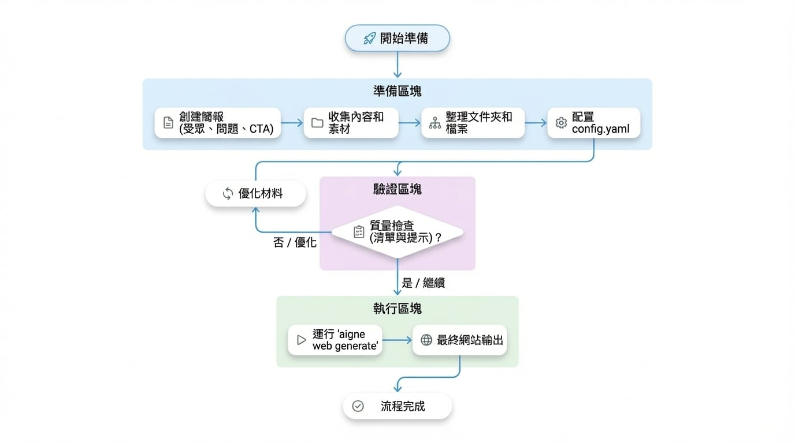

# 準備材料

在您執行 `aigne web generate` 之前，一個出色的網站就已經開始了。本指南為您提供了一份具體的清單，用於收集簡報、來源文件和證明，以便 WebSmith 能夠建立反映您需求、引用正確證據並減少修改次數的頁面。

## 準備工作流程

以下是從收集材料到獲得您第一個網站的流程：

<!-- DIAGRAM_IMAGE_START:flowchart:16:9:1765348253 -->

<!-- DIAGRAM_IMAGE_END -->

每一步都建立在前一步的基礎上。更好的輸入意味著更好的輸出——就是這麼簡單。一個組織良好的內容套件有助於 WebSmith 從一開始就建立權威、符合品牌形象的頁面。

## 步驟 1. 從基礎開始

建立一份簡短的簡報，回答以下四個問題。一個簡單的 Markdown 或 Word 文件即可：

| 問題 | 為何重要 | 範例 |
| :---------------- | :-------------------------------------------------------------------------------------------------- | :---------------------------------------------------------------------- |
| **受眾** | 語氣、詞彙和證明應與頁面的讀者相匹配。 | 「成長階段的金融科技創辦人及其工程主管。」 |
| **問題** | 強調您解決的痛點。 | 「手動入職流程產生了超過 10 小時的重複性合規審查。」 |
| **差異化** | 避免文案聽起來與所有競爭對手一樣。 | 「唯一一個在區域性資料湖上建立 KYC + KYB 自動化的平台。」 |
| **主要行動呼籲 (CTA)** | 將每個部分都導向單一的轉換行動。 | 「預約 20 分鐘的整合審查。」 |

將此檔案儲存在專案中，以便您可以將其新增至 `sourcesPath`。

## 步驟 2. 收集您的內容和資產

WebSmith 會根據您提供的資料進行工作。您提供的相關材料越多，您的網站就會越好。將這些項目整理到一個 `sources` 目錄中：

### 推薦的內容類型

| 內容類型 | 描述 | 範例 |
| :-------------------- | :--------------------------------------------------------------------------------------------------------------------------------------- | :---------------------------------------------------------------------------- |
| **產品文件** | 功能分解、架構說明、API 參考、定價解釋。 | `docs/product-overview.md`、`api/quickstart.md` |
| **行銷計畫** | 定位、訊息架構、活動簡報、競爭對手摘要。 | `marketing/positioning.pdf`、`brand/voice.md` |
| **商業計畫** | 使命、願景、路線圖、融資里程碑、領導團隊簡介。 | `company/mission.txt`、`investor/roadmap.pptx` |
| **現有內容** | 部落格文章、常見問題、變更日誌——任何能展現語氣或可重複故事的內容。 | `blog/*.md`、`faq.md`、`release-notes/2024-02.md` |
| **媒體檔案** | Logo、產品截圖、團隊照片、圖表。 | `assets/logo.svg`、`screenshots/dashboard.png` |

### 支援的格式

| 類別 | 格式 |
| :------------ | :--------------------------------------------------------------------------------------------------------- |
| **文字** | `.md`、`.txt`、`.html`、`.json`、`.yaml`、`.xml` |
| **文件** | `.pdf`、`.doc`、`.docx`、`.xls`、`.xlsx`、`.ppt`、`.pptx` |
| **圖片** | `.jpg`、`.jpeg`、`.png`、`.gif`、`.svg`、`.webp` |
| **程式碼** | `.js`、`.ts`、`.py`、`.go`、`.rs`、`.java`，以及大多數用於程式碼片段提取的主流語言 |

## 步驟 3. 為了清晰而組織

有邏輯地分組您的檔案。這讓您和 WebSmith 都能輕鬆找到所需內容。

```sh project-sources/ icon=lucide:folder-tree
project-sources/
├── 01_briefs/
│   ├── product-overview.md
│   └── audience-matrix.md
├── 02_proof/
│   ├── testimonials.md
│   └── security-metrics.xlsx
├── 03_assets/
│   ├── logo.svg
│   └── dashboard.png
└── 04_content/
    ├── blog/
    └── faq.md
```

使用描述性的資料夾名稱和前綴。應該要能一眼就看出每個目錄包含什麼內容。

## 步驟 4. 在 `config.yaml` 中連接您的來源

將 `sourcesPath` 陣列指向您剛才組織好的目錄（或特定檔案）。這是最重要的單一設定參數。

```yaml config.yaml icon=lucide:file-code
sourcesPath:
  - ./project-sources/01_briefs
  - ./project-sources/02_proof
  - ./project-sources/03_assets
pagePurpose:
  - saas
targetAudienceTypes:
  - businessOwners
  - developers
rules: >
  強調由客戶引言支持的 40% 成本節省。提及 SOC 2 + ISO 27001。
```

當您執行 `aigne web generate` 時，WebSmith 會遞迴地讀取這些資料夾，將檔案分塊，並在撰寫文案和組裝版面時引用它們。

## 選擇您的方法

您有多少時間？選擇適合您情況的方法。

### 快速開始：只需要一個示範？

非常適合當您需要快速建立一些東西並可以在稍後進行優化時。

- 從一份寫得好的 README（約 500 字以上）和幾張螢幕截圖開始
- 將它們加入到 `sourcesPath`
- 執行 `aigne web generate`，檢視結果，然後迭代一次
- 非常適合用於原型、內部示範或試水溫

### 推薦：建立真實的產品

對於大多數推出真正產品或服務的團隊來說，這是最佳選擇。

1.  記錄您的**受眾**、**問題**、**差異化**和 **CTA**
2.  為每個使用者畫像建立一個包含功能性 + 情感性證明的價值矩陣
3.  在讓 WebSmith 撰寫之前，先按意圖概述每個頁面區塊
4.  將推薦、指標和螢幕截圖打包為獨立檔案
5.  生成後，驗證每個區塊是否達到其目標，然後優化並重新執行

### 進階：團隊知識庫

適用於需要發布多個網站或維護長期內容系統的團隊。

- 將您的專業知識拆分成按主題組織的重點 Markdown 檔案
- 範例結構：

```sh
knowledge-base/
├── foundation/
│   ├── mission.md
│   └── brand-voice.md
├── products/
│   ├── payments-overview.md
│   └── payments-technical-specs.md
├── proof-points/
│   ├── case-study-fintech-x.md
│   └── g2-reviews.md
└── audiences/
    ├── developer-persona.md
    └── operator-persona.md
```

這種方法擴展性極佳：
- 為不同專案混合搭配目錄
- 每個網站都從單一的真實來源獲取資料
- 更新一個檔案（`case-study-fintech-x.md`），所有引用它的網站都會自動改進

## 品質檢查清單

在您執行 generate 之前，請確保：

- [ ] 每個主張都有來源檔案中的數據點、引言或指標支持
- [ ] 使用者畫像和 CTA 與行銷文案分開記錄
- [ ] 資產有描述性的名稱（`dashboard-dark.png`，而不是 `image1.png`）
- [ ] 敏感或僅限內部的檔案已被排除（WebSmith 會讀取您指向的所有內容）
- [ ] 來源文件包含知識；風格指南則放在 `rules` 欄位中

## 獲得最佳結果的技巧

WebSmith 的設計目標是一次性生成出色的網站——但品質取決於您提供給它的內容。

- **提供具體細節。** 您的來源材料越具體（數據點、引言、指標），您的網站就越具權威性。
- **將內容分解成重點檔案。** 與其使用一份龐大的文件，不如將主題整理成較小的檔案。這有助於 WebSmith 精確引用來源並生成更結構化的內容。
- **將內容與指令分開。** 將您的知識放在來源檔案中，但將版面和語氣指令保留在它們所屬的 `rules` 欄位中。

## 下一步

<x-cards data-columns="3">
  <x-card data-title="入門指南" data-icon="lucide:rocket" data-href="/getting-started">
    安裝 AIGNE CLI，執行 `aigne web generate`，並檢視您的第一個網站。
  </x-card>
  <x-card data-title="建立網站" data-icon="lucide:wrench" data-href="/guides/create-website">
    了解 generate 工作流程中所有可用的選項。
  </x-card>
  <x-card data-title="發布網站" data-icon="lucide:globe" data-href="/guides/publish-website">
    一旦內容看起來很棒，就部署到 WebSmith Cloud 或您自己的基礎設施上。
  </x-card>
</x-cards>
