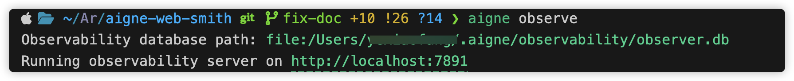

# 故障排除

本指南協助你診斷和修復使用 AIGNE WebSmith 時的常見問題。如果在生成、發布或設定過程中遇到問題，請查看以下場景的解決方案。

---

## 設定問題

### 錯誤 1: "Config file not found"

**錯誤訊息：**
```
Config file not found: .aigne/web-smith/config.yaml
```

**原因：** 設定檔在預期位置不存在。

**修復方法：** 
- 執行 `aigne web generate`（它會引導你自動建立設定，然後開始生成）
- 或執行 `aigne web init`（它會引導你建立設定但不開始生成）

---

### 錯誤 2: "Error parsing config file"

**錯誤訊息：**
```
Error parsing config file: YAML syntax error at line 5, column 3: unexpected character
```

**原因：** 設定檔中存在 YAML 語法錯誤（例如，縮排不正確、冒號錯誤、缺少引號）。

**修復方法：**
1. 檢查錯誤訊息中提到的行號
2. 驗證 YAML 語法（使用空格而非定位字元；使用正確的冒號格式）
3. 使用 YAML 驗證器驗證檔案
4. 重新執行 `aigne web generate`

---

### 錯誤 3: 從 `standard` 切換到 `singlePage` 但未執行 `clear`

**錯誤訊息：**
```
Warning: Website structure mismatch detected. Generated pages may not match the new scale.
```

**原因：** 將 `websiteScale` 從 `standard` 改為 `singlePage` 但未先執行 `clear`，導致結構衝突。

**修復方法：**
1. 執行 `aigne web clear` 刪除舊的已產生檔案
2. 執行 `aigne web generate` 使用新規模重新生成
3. **在變更 `websiteScale` 時，始終在 `generate` 之前執行 `clear`**

---

### 錯誤 4: "Invalid locale code"

**錯誤訊息：**
```
Error: Invalid locale code 'invalid'. Supported codes: en, zh, zh-TW, ja, ko, fr, de, es, pt, ru, it, ar
```

**原因：** 在 `locale` 或 `translateLanguages` 中使用了不支援的語言代碼。

**修復方法：**
1. 檢查支援的語言代碼清單
2. 使用有效的 IETF 語言代碼（例如 `en`、`zh`、`ja`）
3. 更新設定並重新執行命令

---

### 錯誤 5: "No data sources found"

**錯誤訊息：**
```
Warning: No data sources found in sourcesPath. Generated content may be generic.
```

**原因：** `sourcesPath` 為空，或所有指定的路徑不存在或無法存取。

**修復方法：**
1. 驗證 `sourcesPath` 中的檔案/目錄是否存在
2. 檢查檔案權限（確保檔案可讀取）
3. 向 `sourcesPath` 新增有效路徑（例如 `["./README.md", "./docs"]`）
4. 重新執行 `aigne web generate`

---

## 生成問題

### 問題 1: 產生的內容不符合預期

**症狀：**
- 內容語氣不對
- 結構不符合要求
- 缺少關鍵資訊

**常見原因：**
1. 設定中的 `rules` 不充分或不清晰
2. `targetAudienceTypes` 不匹配
3. `sourcesPath` 稀疏或不相關

**修復方法：**
1. **豐富 `rules`：** 在 `config.yaml` 中新增詳細指導：
   ```yaml
   rules: |
     ### 頁面結構要求
     1. 首屏必須包含：
        * 清晰的產品標題
        * 簡潔的描述
        * 主要行動號召
     
     ### 內容語氣
     - 使用積極、自信的語言
     - 包含具體資料和範例
     - 避免行銷術語
   ```

2. **調整受眾：** 確保 `targetAudienceTypes` 與實際受眾匹配：
   ```yaml
   targetAudienceTypes:
     - customers      # 面向最終使用者
     - developers     # 面向技術受眾
   ```

3. **新增更多來源：** 在 `sourcesPath` 中包含相關文件：
   ```yaml
   sourcesPath:
     - ./README.md
     - ./docs
     - ./CHANGELOG.md
   ```

---

### 問題 2: 圖片品質低或缺失

**症狀：**
- 產生頁面中的圖片解析度低
- 預期的圖片未出現

**原因：** `media.minImageWidth` 閾值過濾掉了圖片。

**修復方法：**
1. 檢查 `config.yaml` 中的目前設定：
   ```yaml
   media:
     minImageWidth: 800  # 目前閾值
   ```

2. 根據需求調整：
   - 較低（400-600）：更多圖片，品質風險較低
   - 中等（600-800）：平衡品質/數量（建議）
   - 較高（800-1000）：更高品質，圖片較少

3. 套用變更：
   ```bash
   aigne web update
   ```

---

## 發布問題

### 問題 3: 發布失敗

**症狀：**
- 發布指令失敗
- 發布後網站無法存取
- 授權錯誤

**常見原因：**

**原因 1: 缺少或無效的 `appUrl`**
```yaml
appUrl: ""  # 空或無效
```
**修復方法：** 設定有效的部署 URL：
```yaml
appUrl: https://your-site.user.aigne.io
```

**原因 2: 授權已過期**
**修復方法：** 透過執行以下命令重新授權：
```bash
aigne web publish
```
按照瀏覽器提示重新進行身分驗證。

**原因 3: 網路連線問題**
**修復方法：**
1. 檢查你的網際網路連線
2. 驗證目標 URL 是否可存取
3. 幾分鐘後再試

---

## 翻譯問題

### 問題 4: 翻譯不正確或不完整

**症狀：**
- 缺少翻譯頁面
- 翻譯品質差
- 輸出中語言混雜

**修復方法：**

**對於缺少的翻譯：**
1. 驗證設定中的 `translateLanguages`：
   ```yaml
   translateLanguages:
     - zh
     - ja
   ```

2. 執行翻譯命令：
   ```bash
   aigne web translate
   ```

**對於品質差的問題：**
1. 確保在翻譯前原始內容（`locale` 語言）已完成
2. 使用詞彙表確保術語一致性
3. 如需要，手動審查和改善翻譯

---

## 效能問題

### 問題 5: 生成時間過長

**症狀：**
- `aigne web generate` 執行時間過長
- 系統變得無回應

**常見原因：**

**原因 1: 資料來源過多**
**修復方法：** 將 `sourcesPath` 減少到僅包含必要檔案：
```yaml
sourcesPath:
  - ./README.md
  - ./docs
  # 刪除: ./node_modules（不必要）
  # 刪除: ./dist（產生的檔案）
```

**原因 2: 網站規模過大**
**修復方法：** 從較小的規模開始：
```yaml
websiteScale: minimal  # 或 singlePage
```

**原因 3: 圖片過多**
**修復方法：** 提高 `minImageWidth` 以過濾更多圖片：
```yaml
media:
  minImageWidth: 1000  # 更高的閾值
```

---

## 恢復方法

### 方法 1: Git 回退

如果你使用版本控制，可以恢復到之前的工作設定：

```bash
git revert HEAD
```

然後重新生成：
```bash
aigne web generate
```

---

### 方法 2: 清理重新生成

清除所有產生的檔案並從頭重新生成：

```bash
aigne web clear && aigne web generate
```

這會恢復到乾淨狀態並基於目前設定重新生成網站。

---

### 方法 3: 從備份恢復

如果你有備份設定：

```bash
cp config-backup.yaml .aigne/web-smith/config.yaml
aigne web generate
```

---

### 方法 4: 重新建立設定

如果設定嚴重損壞：

1. 備份目前設定：
   ```bash
   cp .aigne/web-smith/config.yaml config-broken.yaml
   ```

2. 使用初始化精靈重新建立：
   ```bash
   aigne web init
   ```

3. 如需要，從備份合併任何自訂值

---

## 常見 YAML 格式錯誤

### 錯誤: 全形（中文）冒號

**錯誤：**
```yaml
projectName： "My Project"  # 全形冒號
```

**正確：**
```yaml
projectName: "My Project"  # ASCII 冒號
```

---

### 錯誤: 縮排問題

**錯誤：**
```yaml
pagePurpose:
- landingPage  # 缺少縮排
```

**正確：**
```yaml
pagePurpose:
  - landingPage  # 兩個空格縮排
```

---

### 錯誤: 值類型錯誤

**錯誤：**
```yaml
pagePurpose: landingPage  # 字串而非陣列
```

**正確：**
```yaml
pagePurpose:
  - landingPage  # 陣列格式
```

---

### 錯誤: 特殊字元缺少引號

**錯誤：**
```yaml
projectDesc: AI-powered tool: generates websites  # 冒號未加引號
```

**正確：**
```yaml
projectDesc: "AI-powered tool: generates websites"  # 已加引號
```

---

## 預防提示

1. **使用版本控制：** 使用 Git 追蹤設定變更
2. **進行備份：** 在重大編輯前複製設定
3. **驗證變更：** 編輯後執行 `aigne web generate` 以儘早發現錯誤
4. **使用 YAML 驗證器：** 在執行命令前檢查語法
5. **從小開始：** 在新增複雜性之前先用最小設定測試
6. **記錄變更：** 保持對變更內容和原因的記錄

---

## 取得更多協助

如果你嘗試了上述解決方案但仍遇到問題：

1. **查看文件：** 查閱 [Config Reference](./reference-config.md) 指南了解詳細的欄位描述

2. **查看命令參考：** 參閱 [Command Reference](./reference-command.md) 了解詳細的命令用法

3. **檢查記錄：** 查看終端輸出中的特定錯誤訊息

4. **使用可觀測性工具：** 請參閱下文了解如何擷取詳細追蹤

5. **社群支援：** 造訪 [AIGNE 社群](https://community.arcblock.io/discussions/boards/aigne) 尋求協助

---

## 使用可觀測性進行偵錯

當你需要回報問題或偵錯複雜問題時，WebSmith 的可觀測性功能可以擷取詳細的執行追蹤，協助診斷問題所在。

### 啟動可觀測性伺服器

執行以下命令啟動本機追蹤伺服器：

```bash 啟動可觀測性伺服器 icon=lucide:terminal
aigne observe --port 8888
```

你會看到輸出顯示：
- 資料庫路徑：追蹤資料儲存位置
- 伺服器 URL：存取可觀測性儀表板的本機位址



### 檢視追蹤記錄

1. **開啟儀表板：** 點選輸出中顯示的伺服器 URL 或在瀏覽器中開啟

2. **瀏覽追蹤：** 儀表板顯示所有 WebSmith 操作，包括：
   - 輸入/輸出權杖
   - 執行時間
   - 函式呼叫及其結果
   - 錯誤詳情


### 使用追蹤回報問題

向社群回報問題時：

1. **擷取追蹤：** 在出現問題的操作期間保持可觀測性伺服器執行
2. **下載追蹤資料：** 從儀表板匯出相關的追蹤記錄
3. **回報問題：** 造訪 [AIGNE 社群](https://community.arcblock.io/discussions/boards/aigne) 並附上：
   - 問題描述
   - 重現步驟
   - 下載的追蹤檔案
   - 你的設定（如相關）

**提示：** 追蹤包含有關 WebSmith 執行的詳細資訊，使團隊更容易診斷和修復問題。

---

## 常見問題

**問：變更未生效**
- **原因：** 檔案未儲存、YAML 錯誤，或需要重新生成
- **修復：** 儲存檔案、修復 YAML、執行 `aigne web generate`、驗證輸出

**問：如何新增語言？**
- 執行 `aigne web translate` 並按照提示操作
- 該命令會自動更新設定中的 `translateLanguages`

**問：如何修復格式錯誤？**
- **常見問題：** 全形冒號、縮排不一致、陣列格式錯誤
- **修復：** 遵循上面的 YAML 格式範例，如需要可從備份恢復

**問：網站未發布到預期 URL？**
- **檢查：** 驗證設定中的 `appUrl` 與你的預期目標匹配
- **修復：** 更新 `appUrl` 並執行 `aigne web publish`

