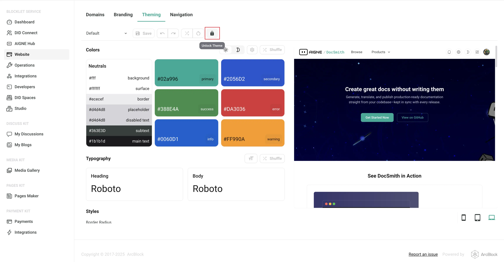

# Understanding Theme Lock in Blocklet Applications

## What is Theme Lock?

Theme lock is a protective mechanism in Blocklet applications that prevents accidental modifications to your website's theme. When enabled, this feature locks the current theme configuration, ensuring that no unintended changes can be made to your website's visual design and styling.

This mechanism is particularly useful in production environments or when you want to preserve a carefully crafted theme design from being overwritten by automated processes or team members who might not be aware of the current theme's importance.

## When You Encounter Theme Lock

When a theme is locked in a Blocklet application, attempting to apply a new theme using the `aigne web theme apply` command will be restricted during the theme upload process. You'll see a message similar to this:

```
Failed to apply theme: Failed to upload theme data: 403 Forbidden
{"code":"internal_server_error","error":"Theme is locked and cannot be modified"}
```

This error indicates that:
- The theme is currently locked and protected from modifications
- The system is preventing any theme changes for security and stability reasons
- You need to unlock the theme before making any changes

## How to Resolve Theme Lock

To unlock a theme and allow modifications, you need to access the website's administrative interface:

1. **Access the Admin Panel**: Log into your website's administrative dashboard
2. **Navigate to Theming**: Go to **WebSite** → **Theming** in the admin menu
3. **Locate the Unlock Button**: Find the unlock button in the theming interface (see image below)
4. **Unlock the Theme**: Click the unlock button to remove the theme lock
5. **Apply Your Changes**: Once unlocked, you can now use `aigne web theme apply` to modify the theme



## Best Practices

- **Use theme lock in production**: Enable theme lock on production websites to prevent accidental theme changes
- **Document theme changes**: When unlocking a theme, document what changes you plan to make
- **Re-lock after changes**: Consider re-enabling theme lock after making your intended modifications
- **Team communication**: Inform your team when theme lock is enabled to avoid confusion during development

## Summary

Theme lock is an essential feature for maintaining theme stability in Blocklet applications. While it may seem like an obstacle when you encounter the 403 Forbidden error during theme uploads with `aigne web theme apply`, it's actually protecting your website's design integrity. By understanding how to properly unlock themes through the Blocklet admin interface, you can maintain both security and flexibility in your theme management workflow.
